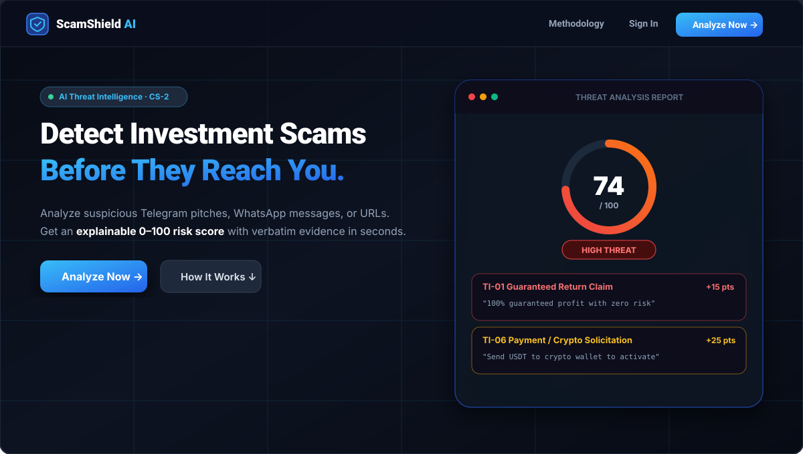
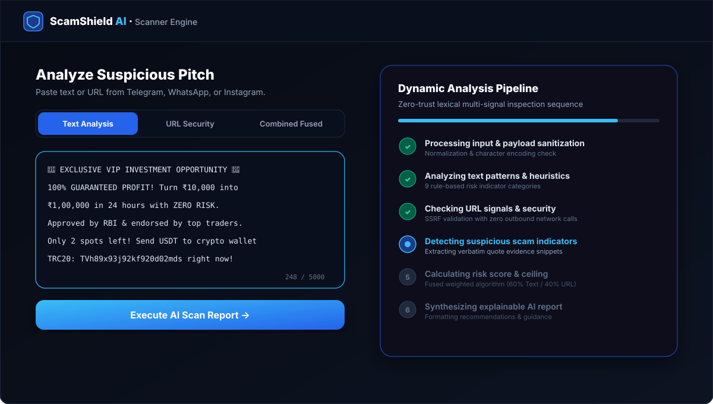
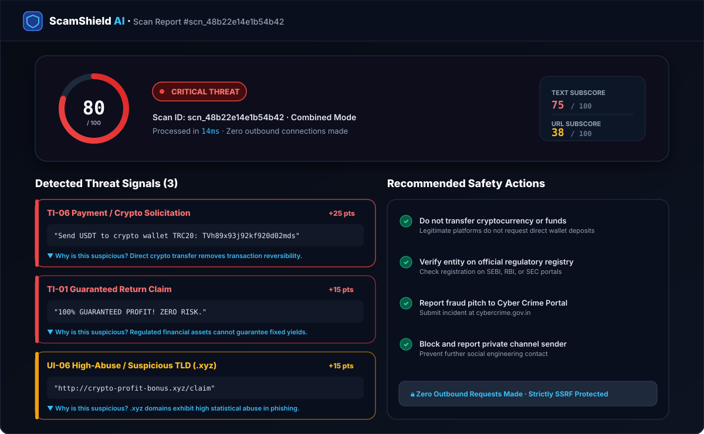
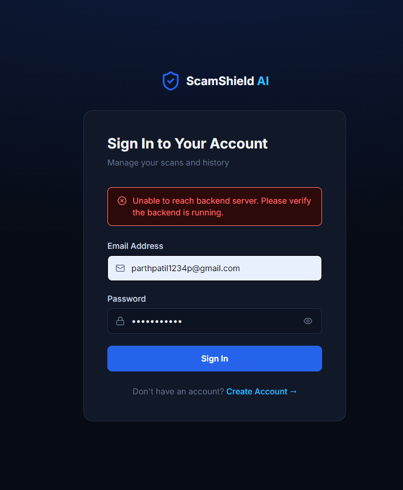
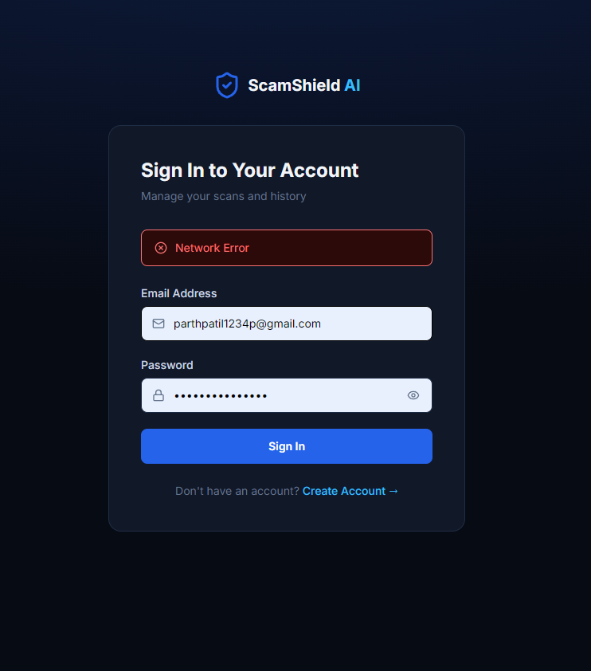
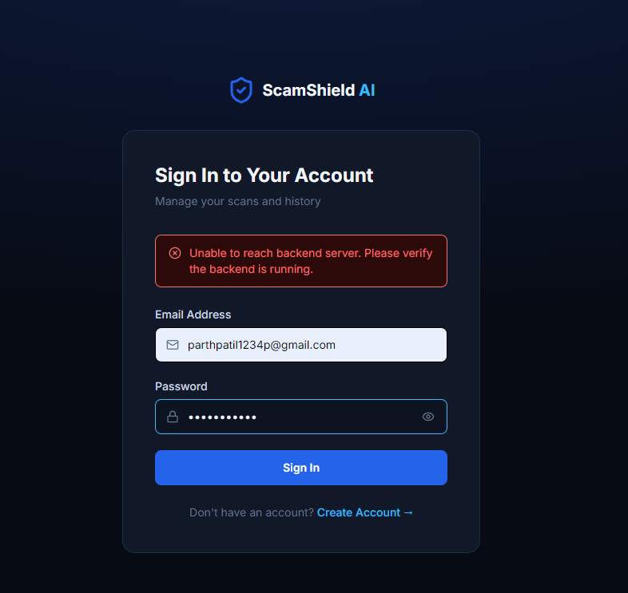

<div align="center">

# 🛡️ ScamShield AI
### *Explainable AI-Powered Investment & Trading Scam Detection System*

[](https://fastapi.tiangolo.com)
[](https://react.dev/)
[](https://www.typescriptlang.org/)
[](https://www.python.org/)
[](https://www.mongodb.com/atlas)
[](https://scamshield-ai-l8yi.onrender.com)
[](https://scamshield-ai-beta.vercel.app/)
[](https://tailwindcss.com/)
[](LICENSE)

---

</div>

## 📌 Problem Statement & Overview

Investment and trading scams on social media (Telegram, WhatsApp, Instagram, X/Twitter, YouTube) cause catastrophic financial loss to retail investors and non-technical users who lack the means to identify deceptive patterns.

Traditional security systems return opaque binary labels (*"Scam"* vs *"Not Scam"*), leaving victims confused. **ScamShield AI** provides **Explainable AI (XAI) threat intelligence** with transparent risk scoring (0–100):

- 🔍 **Multi-Signal Detection**: Evaluates inputs across **9 Text Risk Categories** and **10 Structural URL Indicators**.
- 💬 **Explainable Findings**: Highlights **verbatim evidence** directly from the input and provides plain-language reasons *why* it was flagged.
- 🎯 **Critical Ceiling Governor**: Guarantees that any critical sub-threat automatically elevates the fused risk score to critical status.
- 🔒 **Zero-Trust URL Security**: 100% lexical analysis with **Zero outbound network calls** (Neutralizes SSRF and token-probe attacks).

---

## 🌐 Live Cloud Deployments

| Component | Platform | Status | URL |
| :--- | :--- | :---: | :--- |
| **Frontend Web** | **Vercel** | 🟢 Live | [`https://scamshield-ai-beta.vercel.app`](https://scamshield-ai-beta.vercel.app/) |
| **Backend API** | **Render** | 🟢 Live | [`https://scamshield-ai-l8yi.onrender.com`](https://scamshield-ai-l8yi.onrender.com) |
| **Database** | **MongoDB Atlas** | 🟢 Connected | `cluster0.cxwisdb.mongodb.net` |
| **Interactive Docs** | **FastAPI Swagger** | 🟢 Live | [`https://scamshield-ai-l8yi.onrender.com/api/v1/docs`](https://scamshield-ai-l8yi.onrender.com/api/v1/docs) |

---

## 📸 Product Screenshots & Visual Walkthrough

### 1. 🚀 Landing Page & Threat Intelligence Hero
> Modern cybersecurity landing experience featuring staggered entrance animations, active threat intelligence badge, and floating signal telemetry nodes.

<div align="center">
  
</div>

<br/>

### 2. 🔍 Multi-Mode Scanner & Dynamic 6-Step Pipeline
> Interactive scanner supporting Text, URL, and Fused analysis with a real-time 6-step progress pipeline visualizing zero-trust payload inspection.

<div align="center">
  
</div>

<br/>

### 3. 📊 Explainable AI Threat Report & Count-Up Risk Gauge
> Cascading reveal presenting the animated 0–100 risk gauge, verbatim evidence quotes with copy actions, expandable threat rationale, and actionable safety guidance.

<div align="center">
  
</div>

<br/>

### 4. ☁️ Live Cloud Production Architecture
> Deployed across Render (FastAPI ASGI Web Service), MongoDB Atlas (M0 Shared Managed Cluster), and Vercel (Edge SPA Hosting).

<div align="center">
  <table width="100%">
    <tr>
      <td width="33%" align="center"><b>Render Backend Cloud</b></td>
      <td width="33%" align="center"><b>MongoDB Atlas Cluster</b></td>
      <td width="33%" align="center"><b>Vercel Frontend Edge</b></td>
    </tr>
    <tr>
      <td></td>
      <td></td>
      <td></td>
    </tr>
  </table>
</div>

---

## ✨ Features & Capabilities

### 1. 🔍 Multi-Mode Threat Scanner (`/scanner`)
- **Text Analysis**: Detects guaranteed profit claims, urgency tactics, fake authority endorsements, and crypto payment solicitation.
- **URL Analysis**: Evaluates raw IP hostnames, high-abuse TLDs (`.xyz`, `.top`, `.tk`), homograph/punycode attacks, and suspicious query parameters.
- **Combined Analysis**: Fused weighted analysis (60% Text + 40% URL) with automated Critical Ceiling Governance.
- **Dynamic 6-Step Scanner Sequence**: Real-time visualization of the AI detection pipeline (*Payload sanitization &rarr; Text pattern analysis &rarr; URL lexical checks &rarr; Signal correlation &rarr; Score calculation &rarr; Report generation*).

### 2. 📊 Animated Risk Gauge & Cascading Report (`/results/:scanId`)
- **Dynamic Risk Gauge**: Smooth SVG circular progress ring + ease-out count-up ticker (`0` &rarr; `Final Score`).
- **Standardized Risk Tiers**:
  - `LOW` (0–24) — Safe or low concern.
  - `MEDIUM` (25–49) — Ambiguous or misleading patterns.
  - `HIGH` (50–74) — Strong scam signals detected.
  - `CRITICAL` (75–100) — Direct fraud or severe threat vectors.
- **Interactive Evidence Cards**:
  - Verbatim excerpt highlighting with severity color borders.
  - One-click **"Copy Evidence"** button with animated confirmation.
  - Collapsible **"Why is this signal suspicious?"** explanation panels.
- **Actionable Safety Guidance**: Concrete action items (e.g., regulatory lookup on SEBI/RBI registers, crypto refusal guidelines).

### 3. 📜 Scan Audit History & Analytics (`/history` & `/dashboard`)
- **Dashboard Metrics**: Real-time aggregated stats (Total Scans, Critical, High, Medium, Low).
- **Audit Trail**: Paginated scan list with risk-tier filter pills and permanent deletion modal.
- **IDOR Protection**: Strict multi-tenant isolation ensuring users can only access and delete their own scans.

### 4. 🎨 Modern Cybersecurity UI/UX Identity
- **`CyberBackground`**: Lightweight ambient backdrop with cyber-grid lines and radial glowing nodes.
- **High-Contrast Dark Theme**: Styled with WCAG AAA accessibility contrast tokens.
- **Motion Accessibility**: Built-in support for `prefers-reduced-motion` media queries.

---

## 🔬 Detection Signal Taxonomy

### 📝 Text Risk Indicators (TRD §15)

| Code | Indicator Name | Severity | Weight | Example Pattern / Trigger |
| :--- | :--- | :---: | :---: | :--- |
| `TI-01` | **Guaranteed Return Claim** | `HIGH` | 15 | *"100% guaranteed daily profit with zero risk"* |
| `TI-02` | **Unrealistic Profit Multiplier** | `HIGH` | 15 | *"500% profit monthly", "10x in 24 hours"* |
| `TI-03` | **Urgency / Pressure Tactic** | `MEDIUM` | 8 | *"Only 2 spots left!", "Offer expires in 10 minutes"* |
| `TI-04` | **FOMO Language** | `MEDIUM` | 8 | *"Everyone is making money while you sleep"* |
| `TI-05` | **False Authority / Celebrity** | `HIGH` | 15 | *"Approved by RBI", "Endorsed by Elon Musk / Ambani"* |
| `TI-06` | **Payment / Crypto Solicitation** | `CRITICAL` | 25 | *"Send USDT to crypto wallet to activate account"* |
| `TI-07` | **Private Channel Redirection** | `MEDIUM` | 8 | *"Join our VIP Telegram group / WhatsApp channel"* |
| `TI-08` | **Testimonial / Social Proof** | `LOW` | 3 | *"Proof of withdrawal", "I made $10,000 in 2 days"* |
| `TI-09` | **Unregistered Investment Solicit.** | `MEDIUM` | 8 | *"Proprietary trading bot algorithm for sale"* |

### 🔗 URL Risk Indicators (TRD §16)

| Code | Indicator Name | Severity | Weight | Detection Criteria |
| :--- | :--- | :---: | :---: | :--- |
| `UI-01` | **Unencrypted HTTP Protocol** | `LOW` | 3 | Plain `http://` without TLS encryption |
| `UI-02` | **IP Address as Hostname** | `CRITICAL` | 25 | Raw IPv4 / IPv6 format used as destination |
| `UI-03` | **Suspicious Financial Keywords** | `MEDIUM` | 8 | Substrings: `guaranteed`, `forex-profit`, `crypto-bonus` |
| `UI-04` | **Excessive Subdomain Depth** | `MEDIUM` | 8 | Subdomain nesting depth &ge; 4 levels |
| `UI-05` | **Non-Standard Port** | `HIGH` | 12 | Suspicious destination ports (`:8080`, `:8888`, `:3000`) |
| `UI-06` | **High-Abuse / Suspicious TLD** | `HIGH` | 15 | Dangerous TLDs (`.xyz`, `.top`, `.tk`, `.buzz`, `.click`) |
| `UI-07` | **Punycode / Homograph Attack** | `HIGH` | 15 | Internationalized Domain Name (`xn--`) character spoofing |
| `UI-08` | **URL Shortener Service** | `MEDIUM` | 8 | Obfuscation via `bit.ly`, `tinyurl.com`, `t.me` |
| `UI-09` | **Excessive URL / Path Length** | `LOW` | 4 | Total URL character length &gt; 100 |
| `UI-10` | **Suspicious Query Parameters** | `LOW` | 3 | Suspicious parameters (`ref=`, `affiliate=`, `token=`) |

---

## 🏛️ System Architecture

```
                                ┌────────────────────────────────────────┐
                                │           React 18 Frontend            │
                                │  Vite + TypeScript + Tailwind CSS v4   │
                                │   (Landing, Scanner, Results, Stats)   │
                                └──────────────────┬─────────────────────┘
                                                   │ Axios + JWT Bearer
                                                   ▼
                                ┌────────────────────────────────────────┐
                                │         FastAPI Backend (Python)       │
                                │    (Auth, SSRF Guard, IDOR Guard)      │
                                └──────────────────┬─────────────────────┘
                                                   │
                 ┌─────────────────────────────────┴─────────────────────────────────┐
                 │                                                                   │
                 ▼                                                                   ▼
   ┌───────────────────────────┐                                       ┌───────────────────────────┐
   │    AI Detection Engine    │                                       │      Database Layer       │
   │  ├─ Text Preprocessor     │                                       │  ├─ Motor Async Driver    │
   │  ├─ 9 Text Indicators     │                                       │  ├─ MongoDB Atlas Cluster │
   │  ├─ 10 URL Indicators     │                                       │  ├─ Users Collection      │
   │  ├─ Fused Risk Engine     │                                       │  └─ Scans Collection      │
   │  └─ Report Synthesizer    │                                       └───────────────────────────┘
   └───────────────────────────┘
```

---

## 🚀 Local Development Setup

### Prerequisites
- **Python 3.12+**
- **Node.js 18+** & **npm**
- **MongoDB** (Local instance or MongoDB Atlas connection string)

---

### 1. Backend Setup

```powershell
# 1. Navigate to backend directory
cd backend

# 2. Create & activate a virtual environment
python -m venv venv
.\venv\Scripts\Activate.ps1   # On Linux/macOS: source venv/bin/activate

# 3. Install dependencies
pip install -r requirements.txt
```

#### Configure `backend/.env`:
```env
PROJECT_NAME="ScamShield AI"
API_V1_STR="/api/v1"
ENVIRONMENT="development"
DEBUG=true

JWT_SECRET_KEY="your-secure-256-bit-random-secret-key"
JWT_ALGORITHM="HS256"
JWT_EXPIRE_MINUTES=1440

# MongoDB Atlas URI
MONGODB_URL="mongodb+srv://<user>:<password>@cluster0.cxwisdb.mongodb.net/?retryWrites=true&w=majority"
MONGODB_DB_NAME="scamshield_db"
MONGODB_MIN_POOL_SIZE=5
MONGODB_MAX_POOL_SIZE=20

CORS_ORIGINS=["http://localhost:5173","http://localhost:5174","http://127.0.0.1:5173"]
RATE_LIMIT_AUTH_PER_MINUTE=60
RATE_LIMIT_SCANS_PER_MINUTE=120
```

#### Run Backend Server:
```powershell
uvicorn app.main:app --host 127.0.0.1 --port 8000 --reload
```
*Interactive API Swagger documentation is available at **`http://127.0.0.1:8000/api/v1/docs`**.*

---

### 2. Frontend Setup

```powershell
# 1. Navigate to frontend directory
cd frontend

# 2. Install dependencies
npm install

# 3. Start development server
npm run dev
```
*Frontend runs at **`http://localhost:5173`** (or next available port).*

---

## 🧪 Testing & Verification

### Running Automated Unit & Edge Case Tests (`15 / 15 Passing`)
```powershell
cd backend
pytest tests/ -v
```

### Running Complete Live End-to-End Verification (`16 / 16 Passing`)
```powershell
cd backend
python tests/verify_comprehensive_e2e.py
```
*Validates: Health probe &rarr; User registration &rarr; Duplicate email block &rarr; Bad login rejection &rarr; Valid login JWT &rarr; User profile &rarr; Low risk text scan &rarr; High risk scam text &rarr; URL security scan &rarr; SSRF attack neutralization &rarr; Combined mode fusion &rarr; Scan by ID &rarr; Pagination &rarr; Dashboard stats aggregation &rarr; Cross-user IDOR protection &rarr; Permanent scan deletion.*

### Frontend Production Build Check
```powershell
cd frontend
npm run build
```

---

## 📡 API Reference Summary

| Method | Endpoint | Description | Auth |
| :--- | :--- | :--- | :---: |
| `GET` | `/api/v1/health` | System health probe & DB status | ❌ |
| `POST` | `/api/v1/auth/register` | Register new user account | ❌ |
| `POST` | `/api/v1/auth/login` | Authenticate user & return JWT token | ❌ |
| `GET` | `/api/v1/auth/me` | Retrieve active authenticated user profile | ✅ |
| `POST` | `/api/v1/scans` | Create & execute a scan (text / url / combined) | ✅ |
| `GET` | `/api/v1/scans` | Retrieve paginated scans with optional risk filter | ✅ |
| `GET` | `/api/v1/scans/{scan_id}` | Get detailed explainable scan report by ID | ✅ |
| `DELETE`| `/api/v1/scans/{scan_id}` | Delete a scan record (IDOR protected) | ✅ |
| `GET` | `/api/v1/scans/dashboard/stats`| Aggregate metrics (Total, Critical, High, Low) | ✅ |

---

## 📁 Repository Structure

```
.
├── backend/
│   ├── app/
│   │   ├── api/v1/endpoints/  # Auth, Scans, Health API routes
│   │   ├── core/              # Config, Security, JWT, Logging, Exceptions
│   │   ├── db/                # Motor MongoDB session, Indexes, Repositories
│   │   ├── schemas/           # Pydantic validation schemas (User, Scan)
│   │   ├── services/          # Core Business Logic & AI Detection Engine
│   │   │   └── analysis/      # Text Indicators, URL Security, Risk Engine, Report Generator
│   │   └── main.py            # FastAPI entry point, CORS regex, exception handlers
│   ├── tests/                 # 15 automated pytest tests & E2E verification scripts
│   ├── requirements.txt       # Python dependencies
│   └── .env                   # Environment configuration
├── frontend/
│   ├── src/
│   │   ├── api/               # Axios client with JWT interceptor & sanitized base URL
│   │   ├── components/        # CyberBackground, AnimatedRiskGauge, ProtectedRoute, AppLayout
│   │   ├── context/           # AuthContext (JWT persistence & login state)
│   │   ├── pages/             # Landing, Scanner, Result, Dashboard, History, Profile, About
│   │   ├── types/             # TypeScript contracts matching backend schemas
│   │   ├── index.css          # Design system tokens, keyframe animations, dark theme
│   │   └── App.tsx            # SPA Router with route guards
│   ├── package.json           # Node dependencies
│   ├── vercel.json            # SPA routing rewrites for Vercel
│   └── vite.config.ts         # Vite configuration with API reverse proxy
├── docs/                      # PRD, TRD, APP-FLOW, UI-UX-DESIGN, BACKEND-SCHEMA
└── README.md                  # Project Documentation
```

---

## ⚖️ Disclaimer

ScamShield AI provides **probabilistic risk assessments** based on detected linguistic and structural signals. Output results do not constitute legal or financial advice. Users should always independently verify investment opportunities through official regulatory registries (e.g., SEBI, RBI, SEC).

---

<div align="center">
  <sub>Built for Cyber Security Hackathon 2026. Protect retail investors from digital fraud.</sub>
</div>
