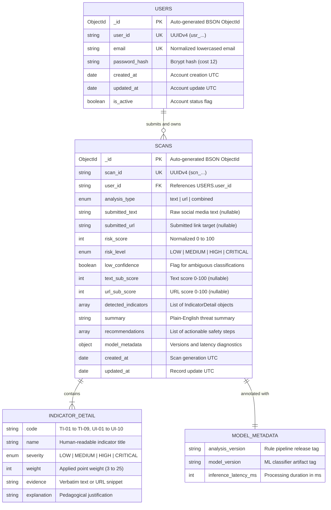
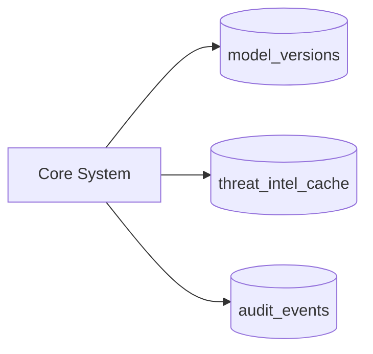

# ScamShield AI — Backend & Database Schema Specification

**Version:** 1.0.0  
**Status:** APPROVED — Engineering Blueprint  
**Created:** 2026-08-20  
**Project:** ScamShield AI  
**Problem Statement Code:** CS-2 (AI-Based Detection of Fake Investment and Trading Scams on Social Media)  
**Parent Documents:** [docs/PRD.md](./PRD.md), [docs/TRD.md](./TRD.md), [docs/UI-UX-DESIGN.md](./UI-UX-DESIGN.md), [docs/APP-FLOW.md](./APP-FLOW.md)  
**Database Engine:** MongoDB 6.0+ / 7.0+ (Motor AsyncIO Driver / MongoDB Atlas)  
**API Layer:** FastAPI + Pydantic v2  

---

## Table of Contents

1. [Architectural Overview & Data Philosophy](#1-architectural-overview--data-philosophy)
2. [Entity-Relationship Diagram (ERD)](#2-entity-relationship-diagram-erd)
3. [Users Collection (`users`)](#3-users-collection-users)
   - 3.1 [BSON Schema & Data Dictionary](#31-bson-schema--data-dictionary)
   - 3.2 [MongoDB Native JSON Schema Validator](#32-mongodb-native-json-schema-validator)
   - 3.3 [Pydantic v2 Models (Python)](#33-pydantic-v2-models-python)
   - 3.4 [TypeScript Synchronization Interfaces](#34-typescript-synchronization-interfaces)
4. [Scans Collection (`scans`)](#4-scans-collection-scans)
   - 4.1 [BSON Schema & Data Dictionary](#41-bson-schema--data-dictionary)
   - 4.2 [Subdocuments & Embedded Structures](#42-subdocuments--embedded-structures)
   - 4.3 [MongoDB Native JSON Schema Validator](#43-mongodb-native-json-schema-validator)
   - 4.4 [Pydantic v2 Models (Python)](#44-pydantic-v2-models-python)
   - 4.5 [TypeScript Synchronization Interfaces](#45-typescript-synchronization-interfaces)
5. [Enumerations & Shared Constants](#5-enumerations--shared-constants)
6. [Indexing Strategy & Query Optimization](#6-indexing-strategy--query-optimization)
7. [Database Aggregation Pipelines](#7-database-aggregation-pipelines)
8. [Data Validation, Privacy & Security Controls](#8-data-validation-privacy--security-controls)
9. [Database Initialization & Golden Dataset Seeding](#9-database-initialization--golden-dataset-seeding)
10. [Future Schema Extensions (Post-MVP)](#10-future-schema-extensions-post-mvp)

---

## 1. Architectural Overview & Data Philosophy

ScamShield AI utilizes MongoDB as its primary persistence engine, paired with Motor (Python AsyncIO driver) and Pydantic v2 for high-performance, asynchronous data validation and serialization.

### 1.1 Data Design Principles
1. **Zero Data Leakage:** User scans are strictly isolated by immutable `user_id` foreign keys. Cross-tenant access is structurally impossible at the repository layer.
2. **Immutable Audit Trail:** Once an analysis is generated, the scan record and detected evidence cannot be modified (`updated_at` is preserved for operational tracking).
3. **Deterministic Type Safety:** Full tripartite type parity across:
   - **MongoDB Engine:** Native `$jsonSchema` BSON validation rules.
   - **Backend Layer:** Pydantic v2 models with runtime type coercion and boundary enforcement.
   - **Frontend Client:** TypeScript static types exported to ensure 100% contract fidelity.
4. **Denormalized Explainability:** Analysis results, detected indicators, verbatim evidence, and synthesized recommendations are stored directly within the scan document to guarantee point-in-time explainability even if indicator algorithms or ML models evolve.

---

## 2. Entity-Relationship Diagram (ERD)



---

## 3. Users Collection (`users`)

### 3.1 BSON Schema & Data Dictionary

| Field | BSON Type | Nullable | Indexed | Unique | Description | Constraints & Format |
|---|---|---|---|---|---|---|
| `_id` | `ObjectId` | No | Yes (PK) | Yes | MongoDB primary key | Auto-generated standard BSON ObjectId |
| `user_id` | `String` | No | Yes | Yes | Public unique user identifier | Format: `usr_[a-f0-9]{16}` or UUIDv4 string |
| `email` | `String` | No | Yes | Yes | User authentication identifier | Lowercased, trimmed, valid RFC 5322 email regex, max 255 chars |
| `password_hash` | `String` | No | No | No | Salted Bcrypt password digest | Format: `$2b$12$...` (Bcrypt cost factor >= 12) |
| `is_active` | `Boolean` | No | No | No | Account status flag | Default: `true`. Allows administrative deactivation |
| `created_at` | `Date` | No | No | No | Account registration timestamp | UTC Date |
| `updated_at` | `Date` | No | No | No | Account metadata update timestamp | UTC Date |

---

### 3.2 MongoDB Native JSON Schema Validator

```javascript
// MongoDB Collection Validation Definition for 'users'
db.createCollection("users", {
  validator: {
    $jsonSchema: {
      bsonType: "object",
      required: ["user_id", "email", "password_hash", "is_active", "created_at", "updated_at"],
      properties: {
        _id: { bsonType: "objectId" },
        user_id: {
          bsonType: "string",
          pattern: "^usr_[a-zA-Z0-9_-]+$",
          description: "Unique string user ID with 'usr_' prefix"
        },
        email: {
          bsonType: "string",
          pattern: "^[a-zA-Z0-9._%+-]+@[a-zA-Z0-9.-]+\\.[a-zA-Z]{2,}$",
          maxLength: 255,
          description: "Must be a valid normalized email address"
        },
        password_hash: {
          bsonType: "string",
          description: "Bcrypt hash string of the user password"
        },
        is_active: {
          bsonType: "bool",
          description: "Indicates whether user account is enabled"
        },
        created_at: {
          bsonType: "date",
          description: "UTC timestamp when user was created"
        },
        updated_at: {
          bsonType: "date",
          description: "UTC timestamp when user was last updated"
        }
      }
    }
  }
});
```

---

### 3.3 Pydantic v2 Models (Python)

```python
"""
backend/app/schemas/user.py
Pydantic v2 schemas for User entity validation and API contracts.
"""
from datetime import datetime
from pydantic import BaseModel, ConfigDict, EmailStr, Field


class UserBase(BaseModel):
    email: EmailStr = Field(..., description="User's valid normalized email address")


class UserCreate(UserBase):
    password: str = Field(
        ...,
        min_length=8,
        max_length=128,
        description="Plaintext password, minimum 8 characters"
    )


class UserLogin(UserBase):
    password: str = Field(..., description="Plaintext password for authentication")


class UserInDB(UserBase):
    model_config = ConfigDict(populate_by_name=True, arbitrary_types_allowed=True)

    user_id: str = Field(..., description="Public unique identifier prefixed with usr_")
    password_hash: str = Field(..., description="Bcrypt password hash")
    is_active: bool = Field(default=True, description="Account active status")
    created_at: datetime = Field(default_factory=datetime.utcnow)
    updated_at: datetime = Field(default_factory=datetime.utcnow)


class UserResponse(UserBase):
    model_config = ConfigDict(from_attributes=True)

    user_id: str
    is_active: bool
    created_at: datetime


class TokenResponse(BaseModel):
    access_token: str
    token_type: str = "bearer"
    expires_in_seconds: int = 3600
    user: UserResponse


class TokenPayload(BaseModel):
    sub: str = Field(..., description="User ID corresponding to user_id")
    email: EmailStr
    iat: int
    exp: int
```

---

### 3.4 TypeScript Synchronization Interfaces

```typescript
/**
 * frontend/src/types/user.ts
 * TypeScript interfaces matching backend user schemas.
 */

export interface User {
  user_id: string;
  email: string;
  is_active: boolean;
  created_at: string; // ISO 8601 UTC
}

export interface AuthResponse {
  success: boolean;
  data: {
    access_token: string;
    token_type: string;
    expires_in_seconds: number;
    user: User;
  };
}

export interface UserStats {
  total_scans: number;
  low_risk_scans: number;
  medium_risk_scans: number;
  high_risk_scans: number;
  critical_risk_scans: number;
}
```

---

## 4. Scans Collection (`scans`)

### 4.1 BSON Schema & Data Dictionary

| Field | BSON Type | Nullable | Indexed | Unique | Description | Constraints & Format |
|---|---|---|---|---|---|---|
| `_id` | `ObjectId` | No | Yes (PK) | Yes | MongoDB primary key | Auto-generated standard BSON ObjectId |
| `scan_id` | `String` | No | Yes | Yes | Public scan identifier | Format: `scn_[a-f0-9]{16}` or UUIDv4 |
| `user_id` | `String` | No | Yes (Compound) | No | Owner foreign key | References `users.user_id` |
| `analysis_type` | `String` | No | No | No | Scan mode selector | Enum: `"text"`, `"url"`, `"combined"` |
| `submitted_text` | `String` | Yes | No | No | Input text analyzed | Max 5,000 characters (UTF-8) |
| `submitted_url` | `String` | Yes | No | No | Input URL analyzed | Max 2,048 characters, RFC 3986 URI |
| `risk_score` | `Int32` | No | No | No | Aggregated risk score | Integer bounded `0 <= risk_score <= 100` |
| `risk_level` | `String` | No | Yes (Compound) | No | Categorical risk tier | Enum: `"LOW"`, `"MEDIUM"`, `"HIGH"`, `"CRITICAL"` |
| `low_confidence` | `Boolean` | No | No | No | Classification ambiguity flag | Default: `false` |
| `text_sub_score` | `Int32` | Yes | No | No | Sub-score for text | Integer bounded `0 <= score <= 100` |
| `url_sub_score` | `Int32` | Yes | No | No | Sub-score for URL | Integer bounded `0 <= score <= 100` |
| `detected_indicators`| `Array[Object]` | No | No | No | Granular matched signals | Array of `IndicatorDetail` subdocuments |
| `summary` | `String` | No | No | No | Plain-language synthesis | Concise explainability overview |
| `recommendations` | `Array[String]` | No | No | No | Defensive guidelines | Array of actionable string advisories |
| `model_metadata` | `Object` | No | No | No | Diagnostic metadata | Contains versions and latency metrics |
| `created_at` | `Date` | No | Yes (Compound) | No | Timestamp of analysis | UTC Date |
| `updated_at` | `Date` | No | No | No | Timestamp of record update | UTC Date |

---

### 4.2 Subdocuments & Embedded Structures

#### Subdocument: `IndicatorDetail`
```typescript
interface IndicatorDetail {
  code: string;                      // Identifier: "TI-01" to "TI-09", "UI-01" to "UI-10"
  name: string;                      // Human-readable title (e.g., "Guaranteed Return Claim")
  severity: "LOW" | "MEDIUM" | "HIGH" | "CRITICAL";
  weight: number;                    // Assigned heuristic/ML weight (3, 8, 15, 25)
  evidence: string;                  // Exact verbatim snippet extracted from input
  explanation: string;               // Plain-language educational explanation of why it was flagged
}
```

#### Subdocument: `ModelMetadata`
```typescript
interface ModelMetadata {
  analysis_version: string;          // Engine release version (e.g., "v1.0.0-rules-baseline")
  model_version: string;             // Active classifier tag (e.g., "baseline-heuristic-v1")
  inference_latency_ms: number;      // Total analysis calculation duration in milliseconds
}
```

---

### 4.3 MongoDB Native JSON Schema Validator

```javascript
// MongoDB Collection Validation Definition for 'scans'
db.createCollection("scans", {
  validator: {
    $jsonSchema: {
      bsonType: "object",
      required: [
        "scan_id",
        "user_id",
        "analysis_type",
        "risk_score",
        "risk_level",
        "low_confidence",
        "detected_indicators",
        "summary",
        "recommendations",
        "model_metadata",
        "created_at",
        "updated_at"
      ],
      properties: {
        _id: { bsonType: "objectId" },
        scan_id: {
          bsonType: "string",
          pattern: "^scn_[a-zA-Z0-9_-]+$",
          description: "Unique scan ID prefixed with 'scn_'"
        },
        user_id: {
          bsonType: "string",
          pattern: "^usr_[a-zA-Z0-9_-]+$",
          description: "Owner user ID prefixed with 'usr_'"
        },
        analysis_type: {
          enum: ["text", "url", "combined"],
          description: "Must be 'text', 'url', or 'combined'"
        },
        submitted_text: {
          bsonType: ["string", "null"],
          maxLength: 5000,
          description: "Submitted text content up to 5,000 characters"
        },
        submitted_url: {
          bsonType: ["string", "null"],
          maxLength: 2048,
          description: "Submitted URL string up to 2,048 characters"
        },
        risk_score: {
          bsonType: "int",
          minimum: 0,
          maximum: 100,
          description: "Calculated risk score integer between 0 and 100"
        },
        risk_level: {
          enum: ["LOW", "MEDIUM", "HIGH", "CRITICAL"],
          description: "Categorical risk level"
        },
        low_confidence: {
          bsonType: "bool",
          description: "Flag indicating classification ambiguity"
        },
        text_sub_score: {
          bsonType: ["int", "null"],
          minimum: 0,
          maximum: 100
        },
        url_sub_score: {
          bsonType: ["int", "null"],
          minimum: 0,
          maximum: 100
        },
        detected_indicators: {
          bsonType: "array",
          items: {
            bsonType: "object",
            required: ["code", "name", "severity", "weight", "evidence", "explanation"],
            properties: {
              code: { bsonType: "string" },
              name: { bsonType: "string" },
              severity: { enum: ["LOW", "MEDIUM", "HIGH", "CRITICAL"] },
              weight: { bsonType: "int", minimum: 0, maximum: 100 },
              evidence: { bsonType: "string" },
              explanation: { bsonType: "string" }
            }
          }
        },
        summary: {
          bsonType: "string",
          description: "Concise summary explanation"
        },
        recommendations: {
          bsonType: "array",
          items: { bsonType: "string" },
          description: "List of actionable safety instructions"
        },
        model_metadata: {
          bsonType: "object",
          required: ["analysis_version", "model_version", "inference_latency_ms"],
          properties: {
            analysis_version: { bsonType: "string" },
            model_version: { bsonType: "string" },
            inference_latency_ms: { bsonType: "int", minimum: 0 }
          }
        },
        created_at: { bsonType: "date" },
        updated_at: { bsonType: "date" }
      }
    }
  }
});
```

---

### 4.4 Pydantic v2 Models (Python)

```python
"""
backend/app/schemas/scan.py
Pydantic v2 schemas for Scan analysis requests, indicator models, and responses.
"""
from datetime import datetime
from enum import Enum
from typing import List, Optional
from pydantic import BaseModel, ConfigDict, Field, HttpUrl, model_validator


class AnalysisTypeEnum(str, Enum):
    TEXT = "text"
    URL = "url"
    COMBINED = "combined"


class RiskLevelEnum(str, Enum):
    LOW = "LOW"
    MEDIUM = "MEDIUM"
    HIGH = "HIGH"
    CRITICAL = "CRITICAL"


class IndicatorSeverityEnum(str, Enum):
    LOW = "LOW"
    MEDIUM = "MEDIUM"
    HIGH = "HIGH"
    CRITICAL = "CRITICAL"


class IndicatorDetailSchema(BaseModel):
    code: str = Field(..., description="Indicator identifier, e.g., TI-01 or UI-03")
    name: str = Field(..., description="Human-readable title of the indicator")
    severity: IndicatorSeverityEnum = Field(..., description="Indicator severity tier")
    weight: int = Field(..., ge=0, le=100, description="Calculated indicator point weight")
    evidence: str = Field(..., description="Verbatim matched text or URL snippet")
    explanation: str = Field(..., description="Plain-language educational context")


class ModelMetadataSchema(BaseModel):
    analysis_version: str = Field(..., description="Version of the analysis rule pipeline")
    model_version: str = Field(..., description="Classifier artifact identifier")
    inference_latency_ms: int = Field(..., ge=0, description="Execution duration in milliseconds")


class ScanCreateRequest(BaseModel):
    analysis_type: AnalysisTypeEnum = Field(..., description="Analysis mode: text, url, or combined")
    text: Optional[str] = Field(None, max_length=5000, description="Text content to scan")
    url: Optional[str] = Field(None, max_length=2048, description="Target URL to analyze")

    @model_validator(mode="after")
    def validate_inputs_match_type(self) -> "ScanCreateRequest":
        if self.analysis_type == AnalysisTypeEnum.TEXT and not (self.text and self.text.strip()):
            raise ValueError("Field 'text' is required when analysis_type is 'text'.")
        if self.analysis_type == AnalysisTypeEnum.URL and not (self.url and self.url.strip()):
            raise ValueError("Field 'url' is required when analysis_type is 'url'.")
        if self.analysis_type == AnalysisTypeEnum.COMBINED:
            if not (self.text and self.text.strip()) or not (self.url and self.url.strip()):
                raise ValueError("Both 'text' and 'url' are required when analysis_type is 'combined'.")
        return self


class ScanResponse(BaseModel):
    model_config = ConfigDict(from_attributes=True)

    scan_id: str
    user_id: str
    analysis_type: AnalysisTypeEnum
    submitted_text: Optional[str] = None
    submitted_url: Optional[str] = None
    risk_score: int = Field(..., ge=0, le=100)
    risk_level: RiskLevelEnum
    low_confidence: bool = False
    text_sub_score: Optional[int] = None
    url_sub_score: Optional[int] = None
    detected_indicators: List[IndicatorDetailSchema] = []
    summary: str
    recommendations: List[str] = []
    model_metadata: ModelMetadataSchema
    created_at: datetime


class ScanSummaryItem(BaseModel):
    model_config = ConfigDict(from_attributes=True)

    scan_id: str
    analysis_type: AnalysisTypeEnum
    risk_score: int
    risk_level: RiskLevelEnum
    indicator_count: int
    summary_preview: str
    created_at: datetime


class ScanListPagination(BaseModel):
    total: int
    page: int
    limit: int
    total_pages: int


class ScanListResponse(BaseModel):
    success: bool = True
    data: List[ScanSummaryItem]
    pagination: ScanListPagination
```

---

### 4.5 TypeScript Synchronization Interfaces

```typescript
/**
 * frontend/src/types/scan.ts
 * TypeScript models matching backend scan data contracts.
 */

export type AnalysisType = 'text' | 'url' | 'combined';
export type RiskLevel = 'LOW' | 'MEDIUM' | 'HIGH' | 'CRITICAL';
export type IndicatorSeverity = 'LOW' | 'MEDIUM' | 'HIGH' | 'CRITICAL';

export interface IndicatorDetail {
  code: string;
  name: string;
  severity: IndicatorSeverity;
  weight: number;
  evidence: string;
  explanation: string;
}

export interface ModelMetadata {
  analysis_version: string;
  model_version: string;
  inference_latency_ms: number;
}

export interface ScanResult {
  scan_id: string;
  user_id: string;
  analysis_type: AnalysisType;
  submitted_text?: string;
  submitted_url?: string;
  risk_score: number;
  risk_level: RiskLevel;
  low_confidence: boolean;
  text_sub_score?: number;
  url_sub_score?: number;
  detected_indicators: IndicatorDetail[];
  summary: string;
  recommendations: string[];
  model_metadata: ModelMetadata;
  created_at: string;
}

export interface ScanHistoryItem {
  scan_id: string;
  analysis_type: AnalysisType;
  risk_score: number;
  risk_level: RiskLevel;
  indicator_count: number;
  summary_preview: string;
  created_at: string;
}

export interface ScanListResponse {
  success: boolean;
  data: ScanHistoryItem[];
  pagination: {
    total: number;
    page: number;
    limit: number;
    total_pages: number;
  };
}
```


---

## 5. Enumerations & Shared Constants

### 5.1 Indicator Code Registry

| Code | Indicator Name | Severity | Default Weight | Domain |
|---|---|---|---|---|
| `TI-01` | Guaranteed Return Claim | `HIGH` | 15 | Text Analysis |
| `TI-02` | Unrealistic Profit Multiplier | `HIGH` | 15 | Text Analysis |
| `TI-03` | Urgency / Pressure Tactic | `MEDIUM` | 8 | Text Analysis |
| `TI-04` | FOMO Language | `MEDIUM` | 8 | Text Analysis |
| `TI-05` | False Authority / Celebrity Impersonation | `HIGH` | 15 | Text Analysis |
| `TI-06` | Payment / Crypto Solicitation | `CRITICAL` | 25 | Text Analysis |
| `TI-07` | Private Channel Redirection (Telegram/WhatsApp) | `MEDIUM` | 8 | Text Analysis |
| `TI-08` | Testimonial / Fake Social Proof | `LOW` | 3 | Text Analysis |
| `TI-09` | Unregistered Investment Solicitation | `MEDIUM` | 8 | Text Analysis |
| `UI-01` | Unencrypted HTTP Protocol | `LOW` | 3 | URL Analysis |
| `UI-02` | Raw IP Hostname in URL | `HIGH` | 15 | URL Analysis |
| `UI-03` | Suspicious Financial Keywords in URL | `MEDIUM` | 8 | URL Analysis |
| `UI-04` | Excessive URL String Length (>100 chars) | `LOW` | 3 | URL Analysis |
| `UI-05` | Excessive Subdomain Depth (>= 3 subdomains) | `MEDIUM` | 8 | URL Analysis |
| `UI-06` | High-Abuse / Suspicious TLD (.top, .xyz, .biz, etc.) | `HIGH` | 15 | URL Analysis |
| `UI-07` | URL Shortener Redirection Domain (bit.ly, tinyurl) | `MEDIUM` | 8 | URL Analysis |
| `UI-08` | Fully Numeric / Random Domain String | `HIGH` | 15 | URL Analysis |
| `UI-09` | Excessive Hyphenation in Domain (>= 3 hyphens) | `LOW` | 3 | URL Analysis |
| `UI-10` | Suspicious Query Parameter Signatures | `LOW` | 3 | URL Analysis |

---

## 6. Indexing Strategy & Query Optimization

### 6.1 Index Registry

```python
"""
backend/app/db/indexes.py
Database index definitions following the Equality, Sort, Range (ESR) rule.
"""
from motor.motor_asyncio import AsyncIOMotorDatabase
import pymongo


async def ensure_indexes(db: AsyncIOMotorDatabase) -> None:
    # -------------------------------------------------------------
    # 1. 'users' Collection Indexes
    # -------------------------------------------------------------
    await db.users.create_index(
        [("email", pymongo.ASCENDING)],
        unique=True,
        name="idx_users_email_unique"
    )
    await db.users.create_index(
        [("user_id", pymongo.ASCENDING)],
        unique=True,
        name="idx_users_user_id_unique"
    )

    # -------------------------------------------------------------
    # 2. 'scans' Collection Indexes
    # -------------------------------------------------------------
    # High-speed O(1) single scan lookup and ownership verification
    await db.scans.create_index(
        [("scan_id", pymongo.ASCENDING)],
        unique=True,
        name="idx_scans_scan_id_unique"
    )

    # Compound Index for paginated history listing with sorting (ESR Rule)
    # Equality: user_id | Sort: created_at (-1)
    await db.scans.create_index(
        [("user_id", pymongo.ASCENDING), ("created_at", pymongo.DESCENDING)],
        name="idx_scans_user_created_at"
    )

    # Compound Index for filtered history by risk tier
    # Equality: user_id, risk_level | Sort: created_at (-1)
    await db.scans.create_index(
        [
            ("user_id", pymongo.ASCENDING),
            ("risk_level", pymongo.ASCENDING),
            ("created_at", pymongo.DESCENDING)
        ],
        name="idx_scans_user_risk_created_at"
    )
```

### 6.2 Query Performance Analysis & Targets

| Operation | Query Pattern | Supporting Index | Target Latency |
|---|---|---|---|
| User Login | `{"email": email}` | `idx_users_email_unique` | < 3ms |
| Auth Dependency | `{"user_id": user_id}` | `idx_users_user_id_unique` | < 2ms |
| Scan Detail Retrieval | `{"scan_id": scan_id, "user_id": user_id}` | `idx_scans_scan_id_unique` | < 3ms |
| Scan History Page 1 | `{"user_id": user_id}.sort({"created_at": -1}).limit(20)` | `idx_scans_user_created_at` (Index Covered Sort) | < 5ms |
| Filtered Scan History | `{"user_id": user_id, "risk_level": "CRITICAL"}.sort({"created_at": -1})` | `idx_scans_user_risk_created_at` | < 5ms |

---

## 7. Database Aggregation Pipelines

### 7.1 User Dashboard Risk Summary Aggregation
Powers the 4-card metric display on `/dashboard` in a single indexed pipeline execution:

```python
async def get_user_dashboard_stats(db: AsyncIOMotorDatabase, user_id: str) -> dict:
    pipeline = [
        {"$match": {"user_id": user_id}},
        {
            "$group": {
                "_id": "$risk_level",
                "count": {"$sum": 1}
            }
        }
    ]
    cursor = db.scans.aggregate(pipeline)
    breakdown = {"LOW": 0, "MEDIUM": 0, "HIGH": 0, "CRITICAL": 0}
    total = 0
    async for doc in cursor:
        level = doc["_id"]
        cnt = doc["count"]
        if level in breakdown:
            breakdown[level] = cnt
        total += cnt

    return {
        "total_scans": total,
        "low_risk_scans": breakdown["LOW"],
        "medium_risk_scans": breakdown["MEDIUM"],
        "high_risk_scans": breakdown["HIGH"],
        "critical_risk_scans": breakdown["CRITICAL"]
    }
```

---

## 8. Data Validation, Privacy & Security Controls

### 8.1 Zero Cross-Tenant Leakage (Ownership Rule)
Repository queries MUST always include `user_id` as part of the match filter:
```python
# GOOD (Ownership strictly enforced):
scan = await db.scans.find_one({"scan_id": scan_id, "user_id": current_user.user_id})

# FORBIDDEN (Allows IDOR vulnerability):
scan = await db.scans.find_one({"scan_id": scan_id})
```

### 8.2 Input Sanitization & Unicode Normalization
- All text input is normalized using Python's `unicodedata.normalize('NFKC', text)` to prevent visual homoglyph evasion.
- Control characters and null bytes (`\x00`) are stripped before regex parsing.
- HTML tags are not executed or rendered in the DOM (`dangerouslySetInnerHTML` is prohibited).

---

## 9. Database Initialization & Golden Dataset Seeding

### 9.1 Database Bootstrap Script (`init_db.py`)

```python
"""
backend/app/db/init_db.py
Executes schema validation initialization, creates indexes, and verifies connectivity.
"""
import asyncio
import logging
from motor.motor_asyncio import AsyncIOMotorClient
from app.core.config import settings
from app.db.indexes import ensure_indexes

logger = logging.getLogger("scamshield.db")


async def init_database() -> None:
    logger.info("Connecting to MongoDB at %s...", settings.MONGODB_URL.split("@")[-1])
    client = AsyncIOMotorClient(
        settings.MONGODB_URL,
        minPoolSize=settings.MONGODB_MIN_POOL_SIZE,
        maxPoolSize=settings.MONGODB_MAX_POOL_SIZE,
        serverSelectionTimeoutMS=5000
    )
    db = client[settings.MONGODB_DB_NAME]
    
    # Ping server
    await db.command("ping")
    logger.info("MongoDB connection verified successfully.")

    # Create indexes
    logger.info("Ensuring database indexes...")
    await ensure_indexes(db)
    logger.info("Database indexes created successfully.")


if __name__ == "__main__":
    logging.basicConfig(level=logging.INFO)
    asyncio.run(init_database())
```

---

## 10. Future Schema Extensions (Post-MVP)



### 10.1 `model_versions` Collection
Tracks ML model iterations, training datasets, F1 scores, and deployment states:
```typescript
interface ModelVersionDocument {
  _id: ObjectId;
  version_id: string;              // e.g. "ml_v2_tfidf_svm"
  model_type: string;              // "logistic_regression", "distilbert"
  precision: number;
  recall: number;
  f1_score: number;
  is_active: boolean;
  artifact_path: string;
  created_at: Date;
}
```

### 10.2 `threat_intel_cache` Collection
Stores third-party domain reputation lookups (VirusTotal / URLhaus) with 24-hour TTL:
```typescript
interface ThreatIntelCacheDocument {
  _id: ObjectId;
  domain: string;                  // Indexed Unique
  reputation_score: number;
  malicious_votes: number;
  harmless_votes: number;
  fetched_at: Date;
  expires_at: Date;                // TTL Index on expires_at with expireAfterSeconds: 0
}
```

---

*End of ScamShield AI Backend & Database Schema Specification*  
*Version 1.0.0 — Created 2026-08-20*  
*This document governs all database implementations, Pydantic validation models, and API serialization contracts.*
