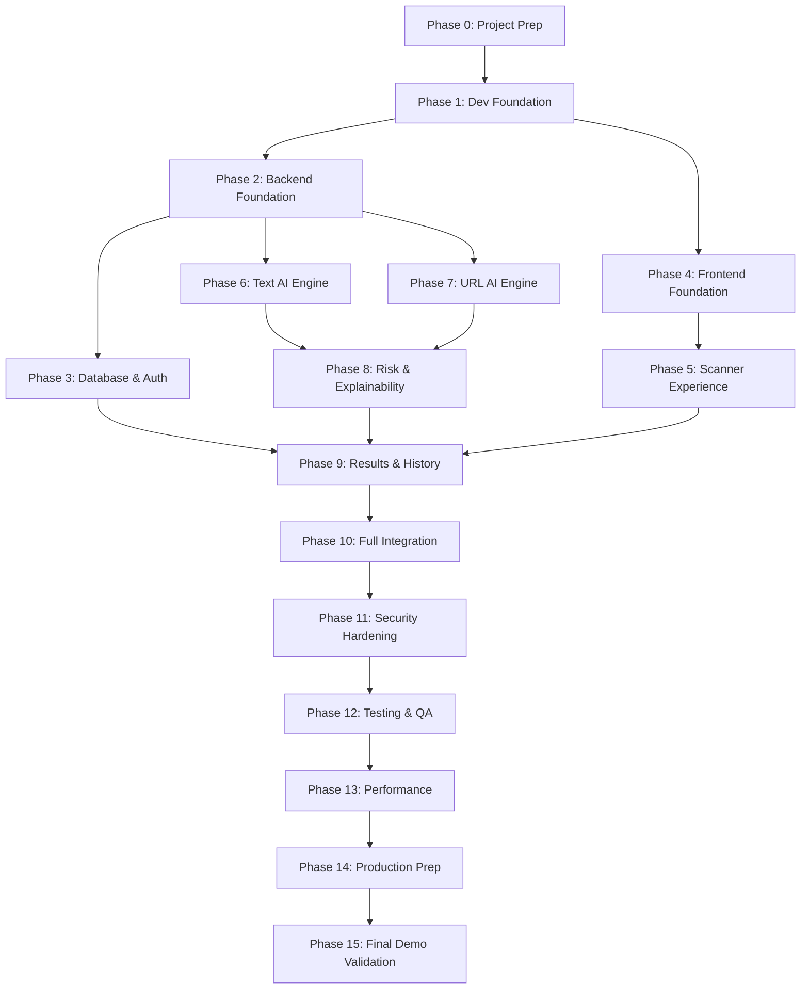

# ScamShield AI — Master Implementation Plan

**Version:** 1.0.0  
**Status:** APPROVED — Engineering Execution Blueprint  
**Created:** 2026-08-21  
**Project:** ScamShield AI  
**Problem Statement Code:** CS-2 (AI-Based Detection of Fake Investment and Trading Scams on Social Media)  
**Parent Documents:**
- [docs/PRD.md](./PRD.md) (Product Requirements Document)
- [docs/TRD.md](./TRD.md) (Technical Requirements Document)
- [docs/APP-FLOW.md](./APP-FLOW.md) (Application Flow Specification)
- [docs/UI-UX-DESIGN.md](./UI-UX-DESIGN.md) (UI/UX Design Specification)
- [docs/BACKEND-SCHEMA.md](./BACKEND-SCHEMA.md) (Backend & Database Schema Specification)
- [docs/technical-decisions.md](./technical-decisions.md) (Architecture Decision Records)

**Tagline:** Detect. Understand. Stay Safe.

---

## Executive Summary & Build Philosophy

This Implementation Plan serves as the master construction roadmap for **ScamShield AI**. It translates the functional requirements (PRD), technical architecture (TRD), visual design tokens (UI/UX), application flows (APP-FLOW), and data models (BACKEND-SCHEMA) into a strictly phased, deterministic sequence of software engineering activities.

### Core Implementation Principles
1. **Zero Guesswork Architecture:** Every file path, interface contract, scoring formula, and UI state is pre-specified. AI coding agents and human engineers must never invent ad-hoc abstractions or diverge from approved specifications.
2. **Incremental, Testable Milestones:** Development advances strictly through verifiable phase gates. No phase begins until the prerequisite phase passes all unit, integration, and security checks.
3. **Fail-Fast Verification:** Critical infrastructure (database connectivity, authentication, schema validation, SSRF guards) is built and stress-tested before feature logic is introduced.
4. **Explainability-First AI:** Analysis engines produce deterministic evidence snippets and plain-English pedagogical explanations before calculating normalized numerical risk scores.
5. **Strict Data Privacy & Ownership:** Multi-tenant query isolation (`user_id` scoping) is enforced at the database repository layer from the first scan query.

---

## Table of Contents

1. [Source of Truth & Architectural Baseline](#1-source-of-truth--architectural-baseline)
2. [Master Phase Overview (Phases 0–15)](#2-master-phase-overview-phases-015)
3. [Phase Specifications](#3-phase-specifications)
   - [Phase 0: Project Preparation](#phase-0-project-preparation)
   - [Phase 1: Repository + Development Foundation](#phase-1-repository--development-foundation)
   - [Phase 2: Backend Foundation](#phase-2-backend-foundation)
   - [Phase 3: Database + Authentication](#phase-3-database--authentication)
   - [Phase 4: Frontend Foundation + Design System](#phase-4-frontend-foundation--design-system)
   - [Phase 5: Scanner Experience](#phase-5-scanner-experience)
   - [Phase 6: Text Analysis Engine](#phase-6-text-analysis-engine)
   - [Phase 7: URL Analysis Engine](#phase-7-url-analysis-engine)
   - [Phase 8: Risk + Explanation + Recommendation Engine](#phase-8-risk--explanation--recommendation-engine)
   - [Phase 9: Results + History](#phase-9-results--history)
   - [Phase 10: Frontend/Backend Integration](#phase-10-frontendbackend-integration)
   - [Phase 11: Security Hardening](#phase-11-security-hardening)
   - [Phase 12: Testing + QA](#phase-12-testing--qa)
   - [Phase 13: Performance + Reliability](#phase-13-performance--reliability)
   - [Phase 14: Production Preparation](#phase-14-production-preparation)
   - [Phase 15: Final Validation + Hackathon Demo](#phase-15-final-validation--hackathon-demo)
4. [Dependency Graph & Build Sequence](#4-dependency-graph--build-sequence)
5. [Critical Path Analysis](#5-critical-path-analysis)
6. [Parallel Work Opportunities](#6-parallel-work-opportunities)
7. [Comprehensive File & Directory Creation Plan](#7-comprehensive-file--directory-creation-plan)
8. [Database Implementation Order](#8-database-implementation-order)
9. [API Implementation Order](#9-api-implementation-order)
10. [AI / NLP Implementation Order](#10-ai--nlp-implementation-order)
11. [Frontend Implementation Order](#11-frontend-implementation-order)
12. [Test-First Strategy & Test Catalog](#12-test-first-strategy--test-catalog)
13. [Global Definition of Done (DoD)](#13-global-definition-of-done-dod)
14. [AI Coding Agent Execution Rules](#14-ai-coding-agent-execution-rules)
15. [Phase Gates & Transition Criteria](#15-phase-gates--transition-criteria)
16. [Implementation Risk Register & Mitigations](#16-implementation-risk-register--mitigations)
17. [Rollback & Recovery Matrix](#17-rollback--recovery-matrix)
18. [Scope Boundaries: MVP vs. Post-MVP vs. Future](#18-scope-boundaries-mvp-vs-post-mvp-vs-future)
19. [Hackathon Demo Priority Matrix](#19-hackathon-demo-priority-matrix)
20. [End-to-End Traceability Matrix](#20-end-to-end-traceability-matrix)
21. [Final Implementation Verification Checklist](#21-final-implementation-verification-checklist)

---

## 1. Source of Truth & Architectural Baseline

The implementation sequence is governed strictly by the following authoritative documents. In case of ambiguity, the precedence hierarchy is:

```
Official Problem Statement CS-2 (Problem Mandate)
                     ↓
       docs/PRD.md (Functional Truth)
                     ↓
       docs/TRD.md (Technical Truth)
                     ↓
 docs/BACKEND-SCHEMA.md (Data Contract Truth)
                     ↓
 docs/UI-UX-DESIGN.md (Visual & Interaction Truth)
                     ↓
   docs/APP-FLOW.md (User Journey Truth)
                     ↓
docs/IMPLEMENTATION-PLAN.md (Execution Truth)
```

---

## 2. Master Phase Overview (Phases 0–15)

```
[Phase 0: Project Prep] ────► [Phase 1: Dev Foundation] ────► [Phase 2: Backend Foundation]
                                                                      │
                                                                      ▼
[Phase 4: Frontend Foundation] ◄─────────────────────────── [Phase 3: DB + Auth]
        │                                                             │
        ▼                                                             ▼
[Phase 5: Scanner Experience] ◄── [Phase 8: Risk Engine] ◄── [Phase 6: Text AI]
        │                                 ▲                           │
        │                                 └───────────────── [Phase 7: URL AI]
        ▼                                                             │
[Phase 9: Results & History] ─────────────────────────────────────────┘
        │
        ▼
[Phase 10: Full Integration] ──► [Phase 11: Security] ──► [Phase 12: Testing]
                                                                  │
                                                                  ▼
[Phase 15: Final Demo Validation] ◄── [Phase 14: Prod Prep] ◄── [Phase 13: Performance]
```

---

## 3. Phase Specifications

### Phase 0: Project Preparation
- **Objective:** Establish workspace structure, document verification, git hygiene, environment configuration templates, and coding standards before any source code is generated.
- **Why this phase exists:** Prevents environment inconsistencies, ensures all engineers and AI agents have an identical understanding of standards, and establishes clean version control.
- **Prerequisites:** All 6 source documentation files present and approved in `docs/`.
- **Inputs:** `docs/PRD.md`, `docs/TRD.md`, `docs/APP-FLOW.md`, `docs/UI-UX-DESIGN.md`, `docs/BACKEND-SCHEMA.md`, `docs/technical-decisions.md`.
- **Tasks:**
  1. Verify existence, readability, and consistency of all 6 source documents.
  2. Define monorepo folder layout: `/backend`, `/frontend`, `/docs`, `/scripts`, `/tests`.
  3. Create root `.gitignore` (ignoring `node_modules`, `__pycache__`, `.venv`, `.env`, build artifacts, coverage reports).
  4. Create environment variable templates: `backend/.env.example` and `frontend/.env.example`.
  5. Document standard Python (PEP 8, Black, Ruff) and TypeScript (ESLint, Prettier) rules.
- **Files Affected:**
  - `[NEW] .gitignore`
  - `[NEW] README.md`
  - `[NEW] backend/.env.example`
  - `[NEW] frontend/.env.example`
- **Work Breakdown:**
  - *Frontend:* Establish directory skeleton `/frontend`.
  - *Backend:* Establish directory skeleton `/backend`.
  - *Database:* Document local MongoDB / Atlas connection string requirements.
  - *AI/ML:* Define artifact storage location `/backend/app/services/analysis/models`.
  - *Security:* Ensure zero secrets are committed; template uses placeholder tokens only.
  - *Testing:* Define test directory trees `/backend/tests` and `/frontend/src/__tests__`.
- **Dependencies:** None.
- **Expected Output:** Clean workspace with verified source docs, directory skeletons, and environment templates.
- **Acceptance Criteria:**
  - `git status` reflects clean structure.
  - All `.env.example` files contain complete parameter lists with documentation.
- **Definition of Done:** Project structure matches TRD Section 4 exactly.
- **Risks:** Incomplete environment variable definitions causing downstream runtime crashes.
- **Rollback Strategy:** Reset git repository state to initial commit.
- **Complexity:** `LOW`

---

### Phase 1: Repository + Development Foundation
- **Objective:** Initialize frontend and backend runtimes, tooling, bundlers, linters, formatters, and baseline test harnesses.
- **Why this phase exists:** Creates the runnable foundation so both applications can boot cleanly in isolation before feature coding.
- **Prerequisites:** Phase 0 complete.
- **Inputs:** `backend/.env.example`, `frontend/.env.example`, TRD Section 2 (Tech Stack).
- **Tasks:**
  1. Initialize Python 3.11 virtual environment with `pyproject.toml` / `requirements.txt` (FastAPI, Uvicorn, Pydantic v2, Motor, PyJWT, Passlib, Bcrypt, Scikit-learn, Pytest, HTTPX).
  2. Initialize React 18+ TypeScript application with Vite (`package.json`, `tsconfig.json`, `vite.config.ts`).
  3. Install and configure Tailwind CSS 3.4+ with PostCSS and Autoprefixer.
  4. Configure Lucide React and Axios on frontend.
  5. Configure Vitest + React Testing Library on frontend.
  6. Configure Pytest + pytest-asyncio on backend.
- **Files Affected:**
  - `[NEW] backend/requirements.txt`
  - `[NEW] backend/pyproject.toml`
  - `[NEW] frontend/package.json`
  - `[NEW] frontend/tsconfig.json`
  - `[NEW] frontend/vite.config.ts`
  - `[NEW] frontend/tailwind.config.js`
  - `[NEW] frontend/postcss.config.js`
- **Work Breakdown:**
  - *Frontend:* Vite scaffold + Tailwind CSS integration.
  - *Backend:* FastAPI base setup + dependency lockfiles.
  - *Database:* None (driver installed in requirements).
  - *AI/ML:* Scikit-learn and regex engine installed in backend environment.
  - *Security:* Set up CORS configuration base in backend config.
  - *Testing:* Verify `pytest` runs (0 tests collected, exit code 0/5) and `npm test` runs cleanly.
- **Dependencies:** Phase 0.
- **Expected Output:** Frontend dev server runs on `http://localhost:5173`; Backend runs on `http://localhost:8000`.
- **Acceptance Criteria:**
  - `npm run build` generates production bundle without TypeScript errors.
  - `pytest` executes without runtime import errors.
- **Definition of Done:** Both frontend and backend start up and test runners execute.
- **Risks:** Dependency version conflicts between Node 20 / Python 3.11 packages.
- **Rollback Strategy:** Revert package lockfiles to known compatible matrix.
- **Complexity:** `LOW`

---

### Phase 2: Backend Foundation
- **Objective:** Build the core FastAPI application infrastructure, centralized settings, standard API response wrappers, exception handlers, structured logging, and health probe.
- **Why this phase exists:** Establishes the uniform architectural patterns that all subsequent backend endpoints, services, and repositories rely upon.
- **Prerequisites:** Phase 1 complete.
- **Inputs:** TRD Sections 9, 10, 27, 32, 33; BACKEND-SCHEMA Section 1.
- **Tasks:**
  1. Implement `app/core/config.py` using Pydantic `BaseSettings` (reading environment variables with fallback defaults).
  2. Implement `app/core/logging.py` for structured JSON/console logging with trace IDs.
  3. Implement standardized exception classes in `app/core/exceptions.py` (AppException, NotFoundException, UnauthorizedException, ForbiddenException, ValidationException, SSRFException).
  4. Implement global exception handlers in `app/main.py` ensuring every error returns the standard TRD error envelope `{ "success": false, "error": { "code", "message", "details" } }`.
  5. Implement CORS, Trusted Host, and Request Timing middleware.
  6. Implement `GET /api/v1/health` endpoint returning system status and component health checks.
- **Files Affected:**
  - `[NEW] backend/app/main.py`
  - `[NEW] backend/app/core/config.py`
  - `[NEW] backend/app/core/logging.py`
  - `[NEW] backend/app/core/exceptions.py`
  - `[NEW] backend/app/api/v1/router.py`
  - `[NEW] backend/app/api/v1/endpoints/health.py`
  - `[NEW] backend/tests/test_health.py`
- **Work Breakdown:**
  - *Backend:* Core application bootstrap, settings, routing structure, exception handlers.
  - *Testing:* Unit tests for config loading, error serialization, and `GET /health` endpoint.
  - *Security:* Secure default headers, restricted CORS origins from settings.
- **Dependencies:** Phase 1.
- **Expected Output:** Bootable FastAPI server with interactive Swagger UI at `/docs` and healthy probe at `/api/v1/health`.
- **Acceptance Criteria:**
  - `GET /api/v1/health` returns `200 OK` with JSON matching TRD §10.1.1.
  - Thrown custom exceptions automatically format to standard JSON error envelope with correct HTTP status codes.
- **Definition of Done:** Backend foundation passes 100% of core unit tests.
- **Risks:** Unhandled exception leaks stack trace to client in production mode.
- **Rollback Strategy:** Revert `main.py` exception handler registration.
- **Complexity:** `MEDIUM`

---

### Phase 3: Database + Authentication
- **Objective:** Implement MongoDB async connection manager, native index initialization, User schema/repository, Bcrypt password hashing, JWT token lifecycle, and authentication/authorization middleware.
- **Why this phase exists:** Secure user identity and resource ownership must be operational before scan records can be created or retrieved.
- **Prerequisites:** Phase 2 complete.
- **Inputs:** TRD Sections 10, 11, 12, 13; BACKEND-SCHEMA Sections 3, 6, 8, 9.
- **Tasks:**
  1. Implement MongoDB async connection lifecycle in `app/db/session.py` with connection pooling.
  2. Implement index initialization in `app/db/indexes.py` (`email` unique, `user_id` unique, compound scan indexes).
  3. Implement Pydantic models for User entity in `app/schemas/user.py` (`UserCreate`, `UserLogin`, `UserResponse`, `TokenResponse`, `TokenPayload`).
  4. Implement Bcrypt hashing and verification in `app/core/security.py` (cost factor 12).
  5. Implement JWT creation and decoding in `app/core/security.py` (HS256, 60-minute expiry).
  6. Implement UserRepository in `app/db/repositories/user_repo.py` (`create_user`, `get_by_email`, `get_by_id`).
  7. Implement AuthService in `app/services/auth_service.py` (registration with duplicate checks, login with password verification).
  8. Implement FastAPI authentication dependency `get_current_user` in `app/api/deps.py`.
  9. Implement endpoints:
     - `POST /api/v1/auth/register` (201 Created)
     - `POST /api/v1/auth/login` (200 OK)
     - `GET /api/v1/auth/me` (200 OK, protected)
  10. Write comprehensive test suite covering registration, duplicate email rejection, invalid password rejection, JWT generation, expired tokens, and `get_current_user` injection.
- **Files Affected:**
  - `[NEW] backend/app/db/session.py`
  - `[NEW] backend/app/db/indexes.py`
  - `[NEW] backend/app/db/init_db.py`
  - `[NEW] backend/app/db/repositories/user_repo.py`
  - `[NEW] backend/app/schemas/user.py`
  - `[NEW] backend/app/core/security.py`
  - `[NEW] backend/app/services/auth_service.py`
  - `[NEW] backend/app/api/deps.py`
  - `[NEW] backend/app/api/v1/endpoints/auth.py`
  - `[NEW] backend/tests/test_auth.py`
- **Work Breakdown:**
  - *Database:* MongoDB connection pooling, `$jsonSchema` validators, unique index creation.
  - *Backend:* Auth endpoints, cryptographic token issuing, dependency injection.
  - *Security:* Plaintext passwords never stored/logged; constant-time password comparisons; token validation.
  - *Testing:* Async API tests for all auth scenarios and edge cases.
- **Dependencies:** Phase 2.
- **Expected Output:** Working authentication system capable of registering users, issuing JWTs, and protecting endpoints.
- **Acceptance Criteria:**
  - Registration succeeds with valid input and fails on duplicate email with `409 Conflict`.
  - Login returns signed JWT.
  - `GET /api/v1/auth/me` returns current user profile with valid Bearer token and `401 Unauthorized` without.
- **Definition of Done:** All auth tests pass, zero plaintext passwords in database, index bootstrap runs on startup.
- **Risks:** MongoDB connection timeouts; token signing key misconfiguration.
- **Rollback Strategy:** Revert auth routes and user repository migrations.
- **Complexity:** `HIGH`

---

### Phase 4: Frontend Foundation + Design System
- **Objective:** Construct the frontend application shell, client-side routing, theme tokens, typography scale, responsive layout containers, and reusable UI component library following `docs/UI-UX-DESIGN.md`.
- **Why this phase exists:** Provides the design system and navigation framework so all subsequent feature pages can be constructed rapidly without ad-hoc styling or inconsistent UI primitives.
- **Prerequisites:** Phase 1 complete.
- **Inputs:** `docs/UI-UX-DESIGN.md`, `docs/APP-FLOW.md`, TRD Sections 5, 6, 7, 8.
- **Tasks:**
  1. Configure Tailwind CSS with custom design tokens from UI/UX spec (Canvas `#070B14`, Surface `#111827`, Brand Blue `#2563EB`, Risk colors: Emerald, Amber, Orange, Rose).
  2. Implement global styles, custom scrollbars, and focus rings (`outline: 2px solid #38BDF8`).
  3. Create Axios API client (`src/api/client.ts`) with request JWT injection and response 401 interception.
  4. Create AuthContext (`src/context/AuthContext.tsx`) for global user state, login/logout actions, and token persistence.
  5. Implement Route Guards (`ProtectedRoute`, `PublicOnlyRoute`) with React Router v6.
  6. Build core atomic UI components:
     - `Button` (Primary, Secondary, Danger, Ghost, Icon, Large CTA) with loading spinner
     - `Input` & `Textarea` with validation error styling and character counters
     - `Badge` & `RiskBadge` (Icon + Label + Background color pair)
     - `Card`, `StatCard`, `Alert`, `Modal` (focus trap + Escape key listener)
     - `Skeleton` and `EmptyState` primitives
     - `Toast` notification system
  7. Build layout containers: `AppLayout` (desktop sidebar + mobile top bar), `Navbar`, `Sidebar`, `Footer`.
  8. Build skeleton pages for all routes: Landing (`/`), Login (`/login`), Register (`/register`), Dashboard (`/dashboard`), Scanner (`/scanner`), Result (`/results/:scanId`), History (`/history`), Profile (`/profile`), About (`/about`), 404 (`/*`).
- **Files Affected:**
  - `[NEW] frontend/src/index.css`
  - `[NEW] frontend/src/types/user.ts`
  - `[NEW] frontend/src/types/scan.ts`
  - `[NEW] frontend/src/api/client.ts`
  - `[NEW] frontend/src/context/AuthContext.tsx`
  - `[NEW] frontend/src/routes/AppRoutes.tsx`
  - `[NEW] frontend/src/routes/ProtectedRoute.tsx`
  - `[NEW] frontend/src/components/ui/Button.tsx`
  - `[NEW] frontend/src/components/ui/Input.tsx`
  - `[NEW] frontend/src/components/ui/Textarea.tsx`
  - `[NEW] frontend/src/components/ui/Badge.tsx`
  - `[NEW] frontend/src/components/ui/Card.tsx`
  - `[NEW] frontend/src/components/ui/Modal.tsx`
  - `[NEW] frontend/src/components/ui/Alert.tsx`
  - `[NEW] frontend/src/components/ui/Toast.tsx`
  - `[NEW] frontend/src/components/layout/AppLayout.tsx`
  - `[NEW] frontend/src/components/layout/Navbar.tsx`
  - `[NEW] frontend/src/components/layout/Sidebar.tsx`
  - `[NEW] frontend/src/components/layout/Footer.tsx`
  - `[NEW] frontend/src/pages/*.tsx` (Page scaffolds)
  - `[NEW] frontend/src/__tests__/Button.test.tsx`
- **Work Breakdown:**
  - *Frontend:* Design token setup, component library, routing, layout shell, auth context.
  - *Accessibility:* Focus states, WCAG 2.1 AA contrast compliance, keyboard navigability.
  - *Testing:* Unit tests for button variants, input validation states, and route guard redirects.
- **Dependencies:** Phase 1.
- **Expected Output:** Fully navigable frontend application shell with consistent dark theme and atomic component catalog.
- **Acceptance Criteria:**
  - All 10 routes render correctly.
  - Protected routes redirect unauthenticated users to `/login`.
  - Design tokens match `docs/UI-UX-DESIGN.md` palette exactly.
  - Layout is responsive across mobile (<768px), tablet (768–1023px), and desktop (>=1024px).
- **Definition of Done:** Component tests pass, no layout shifts, accessibility audit passes with zero contrast violations.
- **Risks:** Broken route redirection loops; Tailwind token mismatches.
- **Rollback Strategy:** Revert route configuration and layout component tree.
- **Complexity:** `MEDIUM`

---

### Phase 5: Scanner Experience
- **Objective:** Implement the interactive Scanner interface (`/scanner`) featuring multi-tab input selection (Text, URL, Combined), character counter, client-side input validation, privacy guidance strip, and multi-stage analysis loading visualization.
- **Why this phase exists:** The Scanner is the primary product interaction screen where users submit suspicious investment content.
- **Prerequisites:** Phase 4 complete.
- **Inputs:** `docs/UI-UX-DESIGN.md` Sections 17 & 18; `docs/APP-FLOW.md` Section 3.2.
- **Tasks:**
  1. Build `ScannerTabGroup` component supporting keyboard arrow navigation (`role="tablist"`).
  2. Implement **Text Scan Tab**:
     - 5,000 character limit with dynamic amber/red character counter.
     - Clear button and paste helper.
     - Input length validation (minimum 10 characters).
  3. Implement **URL Scan Tab**:
     - `https://` prefill helper.
     - Client-side URL scheme validation (`http://` or `https://` only).
     - Informational disclaimer explaining structural analysis without outbound visits.
  4. Implement **Combined Scan Tab**:
     - Synchronized dual-input form validating both text and URL presence.
  5. Implement `PrivacyGuidanceStrip` highlighting account-level data isolation.
  6. Implement `AnalysisLoadingExperience` component:
     - 4-stage sequential progress indicators (Input Validation -> Signal Extraction -> Heuristic/NLP -> Risk Scoring).
     - Non-blocking CSS pulse animation (respects `prefers-reduced-motion`).
  7. Implement form submission state management and error alerts.
- **Files Affected:**
  - `[NEW] frontend/src/components/scanner/ScannerTabGroup.tsx`
  - `[NEW] frontend/src/components/scanner/TextScannerForm.tsx`
  - `[NEW] frontend/src/components/scanner/UrlScannerForm.tsx`
  - `[NEW] frontend/src/components/scanner/CombinedScannerForm.tsx`
  - `[NEW] frontend/src/components/scanner/PrivacyGuidanceStrip.tsx`
  - `[NEW] frontend/src/components/scanner/AnalysisLoadingExperience.tsx`
  - `[MODIFY] frontend/src/pages/ScannerPage.tsx`
  - `[NEW] frontend/src/__tests__/ScannerPage.test.tsx`
- **Work Breakdown:**
  - *Frontend:* Form UI, tab navigation, client validation, animated loading stage component.
  - *Accessibility:* Tab accessibility (`aria-selected`), live region announcements during loading.
  - *Testing:* Test form validation errors, tab switching, and character count boundaries.
- **Dependencies:** Phase 4.
- **Expected Output:** Interactive Scanner page with responsive tabs, real-time input validation, and loading animation.
- **Acceptance Criteria:**
  - Submitting empty text or invalid URL displays inline error messages.
  - Switching tabs preserves entered text/URL state where applicable.
  - Loading screen displays animated stages without fake progress percentages.
- **Definition of Done:** Scanner UI passes component testing and handles all user input states cleanly.
- **Risks:** Form state loss on rapid tab switching.
- **Rollback Strategy:** Revert ScannerPage form component updates.
- **Complexity:** `MEDIUM`

---

### Phase 6: Text Analysis Engine
- **Objective:** Build the core backend text analysis pipeline, including Unicode NFKC normalization, regex-based indicator engine for TI-01 through TI-09, abstract `ScamClassifier` interface, TF-IDF + Machine Learning baseline classifier, model versioning metadata, and unit test suite.
- **Why this phase exists:** Fulfills the primary AI detection mandate of Problem Statement CS-2 for text-based social media promotions.
- **Prerequisites:** Phase 2 complete.
- **Inputs:** PRD Sections 11 & 12; TRD Sections 14, 15, 16, 17; BACKEND-SCHEMA Section 5.
- **Tasks:**
  1. Implement `TextPreprocessor` in `app/services/analysis/text_preprocessor.py`:
     - Unicode NFKC normalization, whitespace collapse, case folding.
     - Stripping null bytes and non-printable control characters.
  2. Implement `TextIndicatorEngine` in `app/services/analysis/text_indicators.py` with compiled regex patterns and weights for all 9 indicators:
     - `TI-01`: Guaranteed Return Claim (Weight: 15, Severity: HIGH)
     - `TI-02`: Unrealistic Profit Multiplier (Weight: 15, Severity: HIGH)
     - `TI-03`: Urgency / Pressure Tactic (Weight: 8, Severity: MEDIUM)
     - `TI-04`: FOMO Language (Weight: 8, Severity: MEDIUM)
     - `TI-05`: False Authority / Celebrity Impersonation (Weight: 15, Severity: HIGH)
     - `TI-06`: Payment / Crypto Solicitation (Weight: 25, Severity: CRITICAL)
     - `TI-07`: Private Channel Redirection (Weight: 8, Severity: MEDIUM)
     - `TI-08`: Testimonial / Social Proof (Weight: 3, Severity: LOW)
     - `TI-09`: Unregistered Investment Solicitation (Weight: 8, Severity: MEDIUM)
  3. Implement abstract `ScamClassifier` interface in `app/services/analysis/base_classifier.py`.
  4. Implement `BaselineRuleClassifier` and `TfidfMLClassifier` in `app/services/analysis/ml_classifier.py` using scikit-learn.
  5. Implement `TextAnalyzerService` orchestrating preprocessing, indicator matching, sub-score calculation (0–100), and latency measurement.
  6. Create golden test fixtures in `tests/fixtures/text_samples.py` covering positive and negative test cases for all 9 indicators.
  7. Write comprehensive unit tests verifying deterministic indicator extraction, sub-score accuracy, and zero false-positive execution on clean financial texts.
- **Files Affected:**
  - `[NEW] backend/app/services/analysis/text_preprocessor.py`
  - `[NEW] backend/app/services/analysis/text_indicators.py`
  - `[NEW] backend/app/services/analysis/base_classifier.py`
  - `[NEW] backend/app/services/analysis/ml_classifier.py`
  - `[NEW] backend/app/services/analysis/text_analyzer.py`
  - `[NEW] backend/tests/fixtures/text_samples.py`
  - `[NEW] backend/tests/test_text_analysis.py`
- **Work Breakdown:**
  - *AI/ML:* Regex indicator engine, Scikit-learn TF-IDF pipeline, model versioning metadata.
  - *Backend:* Text analyzer service integration.
  - *Testing:* Deterministic indicator matching tests, edge-case text inputs (emojis, unicode homoglyphs, empty strings).
- **Dependencies:** Phase 2.
- **Expected Output:** Standalone, deterministic text analysis engine capable of extracting all 9 indicators with verbatim evidence.
- **Acceptance Criteria:**
  - Scam investment texts reliably trigger appropriate TI codes with exact verbatim excerpts.
  - Legitimate financial news produces sub-scores < 25 (LOW risk).
  - Inference latency is under 150ms for 5,000-character inputs.
- **Definition of Done:** 100% of text indicator unit tests pass with zero unhandled exceptions.
- **Risks:** Overly broad regex patterns causing false positives on legitimate financial discussions.
- **Rollback Strategy:** Revert specific indicator regex definitions in `text_indicators.py`.
- **Complexity:** `HIGH`

---

### Phase 7: URL Analysis Engine
- **Objective:** Implement the backend URL analysis pipeline, structural URL parser, lexical signal extractor (UI-01 through UI-10), comprehensive SSRF protection validator, and URL risk sub-scoring engine.
- **Why this phase exists:** Delivers the structural link inspection required by Problem Statement CS-2 without exposing the backend to SSRF or malicious outbound connections.
- **Prerequisites:** Phase 2 complete.
- **Inputs:** PRD Sections 13 & 14; TRD Sections 18, 19, 20; BACKEND-SCHEMA Section 5; ADR-004; ADR-009.
- **Tasks:**
  1. Implement `UrlSecurityValidator` in `app/services/analysis/url_security.py`:
     - Scheme whitelist (`http://`, `https://` only; block `file://`, `gopher://`, `javascript:`, `ftp://`).
     - Loopback blocking (`127.0.0.1`, `localhost`, `::1`).
     - Private RFC 1918 IP blocking (`10.0.0.0/8`, `172.16.0.0/12`, `192.168.0.0/16`).
     - Cloud metadata address blocking (`169.254.169.254`, `metadata.google.internal`).
     - Zero outbound request guarantee (pure structural and lexical inspection in MVP).
  2. Implement `UrlParser` in `app/services/analysis/url_parser.py` extracting scheme, hostname, port, path, query params, TLD, subdomain depth, and entropy.
  3. Implement `UrlIndicatorEngine` in `app/services/analysis/url_indicators.py` detecting all 10 signals:
     - `UI-01`: Unencrypted HTTP Protocol (Weight: 3, Severity: LOW)
     - `UI-02`: Raw IP Hostname (Weight: 15, Severity: HIGH)
     - `UI-03`: Suspicious Financial Keywords (Weight: 8, Severity: MEDIUM)
     - `UI-04`: Excessive URL Length > 100 chars (Weight: 3, Severity: LOW)
     - `UI-05`: Excessive Subdomain Depth >= 3 (Weight: 8, Severity: MEDIUM)
     - `UI-06`: High-Abuse / Suspicious TLD (.top, .xyz, .biz, etc.) (Weight: 15, Severity: HIGH)
     - `UI-07`: URL Shortener Redirection Domain (Weight: 8, Severity: MEDIUM)
     - `UI-08`: Numeric / Random Domain String (Weight: 15, Severity: HIGH)
     - `UI-09`: Excessive Hyphenation >= 3 (Weight: 3, Severity: LOW)
     - `UI-10`: Suspicious Query Parameter Signatures (Weight: 3, Severity: LOW)
  4. Implement `UrlAnalyzerService` orchestrating parsing, SSRF validation, indicator detection, and URL sub-scoring (0–100).
  5. Write unit tests for all 10 URL signals and adversarial SSRF bypass attempts (hex IP, decimal IP, embedded credentials).
- **Files Affected:**
  - `[NEW] backend/app/services/analysis/url_security.py`
  - `[NEW] backend/app/services/analysis/url_parser.py`
  - `[NEW] backend/app/services/analysis/url_indicators.py`
  - `[NEW] backend/app/services/analysis/url_analyzer.py`
  - `[NEW] backend/tests/test_url_analysis.py`
  - `[NEW] backend/tests/test_ssrf_security.py`
- **Work Breakdown:**
  - *Backend:* URL parsing, SSRF defense filter, indicator detection, sub-scoring.
  - *Security:* Full SSRF mitigation suite, protocol whitelisting.
  - *Testing:* URL fixture suite testing valid, invalid, malicious, and benign URLs.
- **Dependencies:** Phase 2.
- **Expected Output:** Secure URL analyzer producing sub-scores and detected signals without issuing network requests.
- **Acceptance Criteria:**
  - All SSRF test vectors are blocked with `422 Unprocessable Entity` or `ValidationException`.
  - Suspicious URL patterns correctly trigger corresponding UI codes.
  - Legitimate domains (e.g. `https://investor.apple.com`) receive sub-score 0 (LOW risk).
- **Definition of Done:** URL engine passes 100% of functional and SSRF security tests.
- **Risks:** Incomplete TLD or URL-shortener dictionaries.
- **Rollback Strategy:** Revert URL indicator weightings or parser rules.
- **Complexity:** `MEDIUM`

---

### Phase 8: Risk + Explanation + Recommendation Engine
- **Objective:** Construct the centralized Risk Scoring Fusion Engine, dynamic Explainability Synthesis Engine, and Actionable Safety Recommendation Engine.
- **Why this phase exists:** Unifies independent text and URL analyses into a single explainable risk score (0–100), categorical risk tier (LOW/MEDIUM/HIGH/CRITICAL), pedagogical justification, and clear user action items.
- **Prerequisites:** Phases 6 & 7 complete.
- **Inputs:** PRD Sections 15, 16, 17, 18; TRD Sections 21, 22, 23, 24; ADR-005; ADR-006.
- **Tasks:**
  1. Implement `RiskScoringEngine` in `app/services/analysis/risk_engine.py`:
     - Weighted fusion formula for combined scans: $CombinedScore = (TextScore \times 0.60) + (UrlScore \times 0.40)$.
     - Critical Ceiling Governor: If $TextScore \ge 75$ or $UrlScore \ge 75$, then $CombinedScore = \max(CombinedScore, 75)$.
     - Risk Tier boundaries: LOW (0–24), MEDIUM (25–49), HIGH (50–74), CRITICAL (75–100).
     - Zero hardcoded magic numbers (all weights and boundaries imported from `core/config.py`).
  2. Implement `ExplainabilityEngine` in `app/services/analysis/explainability_engine.py`:
     - 5-Question framework synthesis (What was detected? Where in the text? Why is it dangerous? How severe is it? What should you do?).
     - Dynamic summary generator composing natural-language narrative based on top severity indicators.
  3. Implement `RecommendationEngine` in `app/services/analysis/recommendation_engine.py`:
     - Contextual safety rules matching detected indicators and overall risk tier.
     - Mandatory disclaimers (probabilistic assessment, non-legal advice).
  4. Implement `AnalysisOrchestrator` in `app/services/analysis/orchestrator.py` coordinating the full end-to-end analysis pipeline.
  5. Write unit tests for risk math formulas, ceiling overrides, tier transitions, and explanation generation.
- **Files Affected:**
  - `[NEW] backend/app/services/analysis/risk_engine.py`
  - `[NEW] backend/app/services/analysis/explainability_engine.py`
  - `[NEW] backend/app/services/analysis/recommendation_engine.py`
  - `[NEW] backend/app/services/analysis/orchestrator.py`
  - `[NEW] backend/tests/test_risk_engine.py`
  - `[NEW] backend/tests/test_explainability.py`
- **Work Breakdown:**
  - *AI/ML:* Mathematical fusion algorithms, explainability rule engine.
  - *Backend:* Orchestration pipeline tying text, URL, risk, and explainability modules together.
  - *Testing:* Unit tests covering boundary values (24 vs 25, 49 vs 50, 74 vs 75) and ceiling overrides.
- **Dependencies:** Phases 6 & 7.
- **Expected Output:** Fully integrated analysis orchestrator generating complete, explainable risk reports.
- **Acceptance Criteria:**
  - Risk math matches TRD §21 & §22 exact formulas.
  - High-risk indicator on one sub-score guarantees overall score $\ge 75$ (Ceiling Governor).
  - Generated explanations and recommendations directly correspond to detected signals.
- **Definition of Done:** Orchestrator unit tests pass with 100% deterministic outputs on fixture datasets.
- **Risks:** Rounding errors causing edge-case tier mismatches.
- **Rollback Strategy:** Revert risk engine configuration parameters.
- **Complexity:** `HIGH`

---

### Phase 9: Results + History
- **Objective:** Implement complete database persistence for scans, scan CRUD endpoints (Create, List with pagination & filters, Get detail by ID, Delete with ownership check), and build the comprehensive frontend Result and History pages.
- **Why this phase exists:** Enables users to view, understand, review, and manage their scan results and historical activity over time.
- **Prerequisites:** Phases 3, 5, & 8 complete.
- **Inputs:** PRD Sections 19, 20, 21; TRD Sections 10, 12, 13; UI-UX-DESIGN Sections 19, 20, 21, 22, 23, 24, 25, 26; BACKEND-SCHEMA Sections 4 & 7.
- **Tasks:**
  1. Implement `ScanRepository` in `app/db/repositories/scan_repo.py`:
     - `create_scan(scan_data)` -> persists scan document.
     - `get_scan_by_id(scan_id, user_id)` -> fetches single scan with strict ownership scoping.
     - `list_user_scans(user_id, page, limit, risk_level)` -> paginated query using compound indexes.
     - `delete_scan(scan_id, user_id)` -> deletes single scan with ownership verification.
     - `get_user_dashboard_stats(user_id)` -> executes MongoDB aggregation pipeline.
  2. Implement Scan Service in `app/services/scan_service.py` integrating the `AnalysisOrchestrator` and `ScanRepository`.
  3. Implement Scan API Endpoints in `app/api/v1/endpoints/scans.py`:
     - `POST /api/v1/scans` (201 Created -> executes analysis, persists, returns complete result)
     - `GET /api/v1/scans` (200 OK -> paginated scan summaries with risk filter)
     - `GET /api/v1/scans/{scan_id}` (200 OK -> full scan report)
     - `DELETE /api/v1/scans/{scan_id}` (200 OK -> deletes scan)
     - `GET /api/v1/dashboard/stats` (200 OK -> risk tier counts)
  4. Build Frontend **Result Page** (`/results/:scanId`):
     - `RiskScoreGauge` (Large circular arc progress or score bar + RiskBadge + Descriptor)
     - `IndicatorCardList` rendering individual `IndicatorCard` items with severity tags
     - `EvidenceBlock` rendering verbatim code snippets
     - `WhyFlaggedSection` explaining pedagogical threat reasoning
     - `RecommendationCard` detailing actionable safety advice
     - `AnalysisDetailsPanel` (collapsible technical diagnostic metadata)
     - Top navigation with "Back to Scanner" and "Delete Scan" actions
     - Mandatory product disclaimer banner
  5. Build Frontend **History Page** (`/history`):
     - Desktop data table / Mobile card list
     - Risk level filter chips (All, LOW, MEDIUM, HIGH, CRITICAL)
     - Pagination controls (`Previous`, `Next`, Page numbers)
     - Delete confirmation modal (`DeleteModal`) with danger button
     - Empty states for no history / no filter matches
  6. Build Frontend **Dashboard Page** (`/dashboard`):
     - 4 StatCards (Total Scans, LOW, MEDIUM, HIGH/CRITICAL counts)
     - Recent Scans list with direct link to results
     - Quick "New Scan" launcher button
- **Files Affected:**
  - `[NEW] backend/app/db/repositories/scan_repo.py`
  - `[NEW] backend/app/services/scan_service.py`
  - `[NEW] backend/app/api/v1/endpoints/scans.py`
  - `[NEW] backend/app/api/v1/endpoints/dashboard.py`
  - `[NEW] frontend/src/components/results/RiskScoreGauge.tsx`
  - `[NEW] frontend/src/components/results/IndicatorCard.tsx`
  - `[NEW] frontend/src/components/results/EvidenceBlock.tsx`
  - `[NEW] frontend/src/components/results/RecommendationCard.tsx`
  - `[NEW] frontend/src/components/results/AnalysisDetailsPanel.tsx`
  - `[NEW] frontend/src/components/history/ScanHistoryTable.tsx`
  - `[NEW] frontend/src/components/history/ScanHistoryCard.tsx`
  - `[NEW] frontend/src/components/history/DeleteConfirmModal.tsx`
  - `[MODIFY] frontend/src/pages/ResultPage.tsx`
  - `[MODIFY] frontend/src/pages/HistoryPage.tsx`
  - `[MODIFY] frontend/src/pages/DashboardPage.tsx`
  - `[NEW] backend/tests/test_scans_api.py`
  - `[NEW] backend/tests/test_ownership_security.py`
- **Work Breakdown:**
  - *Backend:* Scan repositories, endpoints, pagination logic, ownership guards.
  - *Frontend:* Result visualizations, indicator cards, history table, dashboard metrics.
  - *Security:* Strict IDOR prevention — cross-user scan reads/deletes must return 403 or 404.
  - *Testing:* API tests for scan CRUD, pagination limits, filter combinations, and delete isolation.
- **Dependencies:** Phases 3, 5, & 8.
- **Expected Output:** Complete scan lifecycle operational from submission through explainable result view, historical storage, filtering, and deletion.
- **Acceptance Criteria:**
  - User A cannot view or delete User B's scans.
  - Scans are persisted with complete indicator, evidence, and recommendation data.
  - Result page clearly visualizes score, evidence, and safety advice within 2 seconds.
- **Definition of Done:** Result and History pages pass all integration tests, zero IDOR vulnerabilities, pagination functions seamlessly.
- **Risks:** Slow unindexed scan queries on large datasets.
- **Rollback Strategy:** Revert scan endpoint routing and database repository methods.
- **Complexity:** `HIGH`

---

### Phase 10: Frontend/Backend Integration
- **Objective:** Wire all frontend components to live backend endpoints, test all user flows in sequence, verify error propagation, token refresh/expiration handling, and state synchronization.
- **Why this phase exists:** Confirms that the end-to-end user journey works flawlessly across the full client-server stack.
- **Prerequisites:** All Phases 1 through 9 complete.
- **Inputs:** `docs/APP-FLOW.md`, `docs/UI-UX-DESIGN.md`, all implemented APIs and UI pages.
- **Tasks:**
  1. Connect `AuthContext` to `POST /auth/register`, `POST /auth/login`, and `GET /auth/me`.
  2. Connect Scanner form submissions to `POST /api/v1/scans` and auto-navigate to `/results/:scanId`.
  3. Connect Result Page to `GET /api/v1/scans/:scanId` with loading skeletons and error fallbacks.
  4. Connect History Page to `GET /api/v1/scans?page=X&limit=Y&risk_level=Z` and `DELETE /api/v1/scans/:scanId`.
  5. Connect Dashboard Page to `GET /api/v1/dashboard/stats` and recent scans feed.
  6. Verify complete end-to-end golden journey:
     `Landing -> Register -> Login -> Dashboard -> Scanner (Text) -> Result -> Scanner (URL) -> Result -> Scanner (Combined) -> Result -> History -> Delete -> Profile -> Logout`.
  7. Verify error toasts for network drops, 401 session expirations, 422 validation errors, and 404 missing scans.
- **Files Affected:**
  - `[MODIFY] frontend/src/api/client.ts`
  - `[MODIFY] frontend/src/pages/*.tsx`
  - `[NEW] frontend/src/__tests__/integration/UserJourney.test.tsx`
- **Work Breakdown:**
  - *Full-Stack:* API hookups, loading/error states, cross-page state transitions.
  - *Testing:* Automated integration test simulating complete multi-step user session.
- **Dependencies:** Phases 1–9.
- **Expected Output:** Fully working, end-to-end integrated application with seamless navigation and error handling.
- **Acceptance Criteria:**
  - 100% of user flows in `docs/APP-FLOW.md` execute without errors or broken links.
  - All UI state transitions feel smooth and responsive (<300ms transition time).
- **Definition of Done:** End-to-end journey executes cleanly without console errors or unhandled promises.
- **Risks:** CORS discrepancies; mismatched API response key names.
- **Rollback Strategy:** Revert specific API client call wrappers.
- **Complexity:** `MEDIUM`

---

### Phase 11: Security Hardening
- **Objective:** Perform systematic security hardening across authentication, authorization, input sanitization, SSRF prevention, rate limiting, request size caps, CORS, secure HTTP headers, and error message sanitization.
- **Why this phase exists:** Ensures ScamShield AI adheres to the strict security standards of a cybersecurity product before testing and deployment.
- **Prerequisites:** Phase 10 complete.
- **Inputs:** PRD Section 29; TRD Sections 28, 29, 30, 31, 43; BACKEND-SCHEMA Section 8; ADR-002, ADR-007, ADR-009.
- **Tasks:**
  1. Configure `SlowAPIRateLimiter` for sensitive endpoints:
     - `/auth/login` and `/auth/register`: 5 requests/min per IP.
     - `/api/v1/scans`: 30 requests/min per user.
  2. Implement request body size limits in FastAPI middleware (1MB max payload).
  3. Verify Bcrypt salt rounds $\ge 12$ and constant-time password hash verification.
  4. Verify JWT signing secret entropy ($\ge 256$ bits) and strict expiration enforcement.
  5. Enforce CORS origin whitelist from environment configuration (no wildcard `*` in production).
  6. Add security response headers:
     - `X-Content-Type-Options: nosniff`
     - `X-Frame-Options: DENY`
     - `X-XSS-Protection: 1; mode=block`
     - `Strict-Transport-Security: max-age=31536000; includeSubDomains`
     - `Content-Security-Policy: default-src 'self'`
  7. Audit application for dangerous HTML injection (verify zero `dangerouslySetInnerHTML` in frontend).
  8. Verify error sanitization — ensure internal stack traces, database error strings, and file paths are never returned to clients.
- **Files Affected:**
  - `[MODIFY] backend/app/main.py`
  - `[NEW] backend/app/core/rate_limit.py`
  - `[NEW] backend/app/core/security_headers.py`
  - `[NEW] backend/tests/test_security_hardening.py`
- **Work Breakdown:**
  - *Security:* Rate limiting, security headers, request caps, payload sanitization.
  - *Testing:* Automated security tests for rate limiting, header presence, and information leakage.
- **Dependencies:** Phase 10.
- **Expected Output:** Hardened backend and frontend resistant to common OWASP Top 10 vulnerabilities.
- **Acceptance Criteria:**
  - Rate limiting triggers `429 Too Many Requests` on abuse.
  - Security headers present in all HTTP responses.
  - No secrets, tokens, or internal stack traces exposed in error responses.
- **Definition of Done:** Security test suite passes with zero high/critical vulnerabilities.
- **Risks:** Overly strict CSP breaking font or icon loading.
- **Rollback Strategy:** Relax specific CSP directives in `security_headers.py`.
- **Complexity:** `MEDIUM`

---

### Phase 12: Testing + QA
- **Objective:** Execute full-spectrum automated testing across unit, integration, API, security, accessibility (WCAG 2.1 AA), and responsive design dimensions.
- **Why this phase exists:** Validates system correctness, prevents regressions, and guarantees enterprise quality before demo and deployment.
- **Prerequisites:** Phase 11 complete.
- **Inputs:** TRD Section 35; UI-UX-DESIGN Sections 30 & 38; BACKEND-SCHEMA Section 6.
- **Tasks:**
  1. Backend Unit & API Testing (Pytest):
     - Auth test suite (Registration, Login, Token validation, Password hashing).
     - Text Analysis suite (TI-01 to TI-09 pattern matching, weights, confidence).
     - URL Analysis suite (UI-01 to UI-10 signals, SSRF blocking).
     - Risk Engine suite (Formulas, Ceiling Governor, Tier boundaries).
     - Scan Repository & Ownership suite (CRUD, Pagination, IDOR prevention).
     - Error handling suite (400, 401, 403, 404, 422, 500 status formats).
  2. Frontend Component & Integration Testing (Vitest + RTL):
     - Component render tests for Button, Input, Modal, RiskScoreGauge, IndicatorCard.
     - AuthContext integration and route protection tests.
     - Scanner form submission and loading sequence tests.
  3. Accessibility Audit (a11y):
     - Keyboard navigation audit (Tab order, Focus traps in modals, Escape listener).
     - Color contrast verification (WCAG 2.1 AA >= 4.5:1 for text, >= 3:1 for UI elements).
     - ARIA attributes verification (`role="status"`, `role="tablist"`, `aria-describedby`).
  4. Responsive Design Audit:
     - Verify layouts on Mobile (375px, 414px), Tablet (768px), and Desktop (1280px, 1536px).
- **Files Affected:**
  - `[NEW] backend/tests/**/*.py` (Expanded test suite)
  - `[NEW] frontend/src/__tests__/**/*.test.tsx` (Expanded test suite)
  - `[NEW] docs/TEST-REPORT.md`
- **Work Breakdown:**
  - *QA & Testing:* Test execution, golden dataset evaluation, coverage reporting, a11y audit.
- **Dependencies:** Phase 11.
- **Expected Output:** Comprehensive test report demonstrating $>85\%$ backend test coverage and zero accessibility failures.
- **Acceptance Criteria:**
  - All automated tests pass (`pytest` and `npm test` exit code 0).
  - Accessibility audit passes with zero critical violations.
- **Definition of Done:** Test suite executes reliably in CI/CD automation.
- **Risks:** Flaky async tests due to unseeded timers.
- **Rollback Strategy:** Fix and stabilize failing test assertions.
- **Complexity:** `MEDIUM`

---

### Phase 13: Performance + Reliability
- **Objective:** Measure and optimize backend API latency, database query execution times, and frontend bundle size to ensure rapid, deterministic performance under load.
- **Why this phase exists:** Guarantees that scan analysis completes in $<250\text{ms}$ and database lookups in $<5\text{ms}$.
- **Prerequisites:** Phase 12 complete.
- **Inputs:** TRD Sections 37 & 38; BACKEND-SCHEMA Section 6.2.
- **Tasks:**
  1. Profile backend analysis pipeline latency (Regex precompilation, scikit-learn pipeline optimization).
  2. Verify MongoDB index coverage with `.explain("executionStats")`:
     - Ensure `users` lookup uses indexed scan (COLLSCAN count: 0).
     - Ensure paginated `scans` queries use index-covered sorts.
  3. Optimize frontend production build:
     - Verify Vite chunk splitting and tree-shaking for Lucide React icons.
     - Measure production bundle size (Target: $< 350\text{KB}$ gzipped).
  4. Perform concurrency stress test on `/api/v1/scans` (50 concurrent requests).
  5. Verify graceful degradation under simulated ML classifier failures (pipeline falls back to heuristic baseline without throwing 500).
- **Files Affected:**
  - `[MODIFY] backend/app/services/analysis/orchestrator.py`
  - `[MODIFY] frontend/vite.config.ts`
  - `[NEW] backend/tests/test_performance.py`
- **Work Breakdown:**
  - *DevOps & Backend:* Latency profiling, index verification, stress testing.
  - *Frontend:* Bundle optimization, lazy loading non-critical routes.
- **Dependencies:** Phase 12.
- **Expected Output:** High-performance, production-tuned application with benchmarked latency metrics.
- **Acceptance Criteria:**
  - Single text/URL scan completes in $< 250\text{ms}$ (P95).
  - Paginated history query executes in $< 10\text{ms}$.
  - Production frontend bundle $< 350\text{KB}$ gzipped.
- **Definition of Done:** Performance benchmarks meet all TRD §37 targets.
- **Risks:** Memory bloat during concurrent regex executions.
- **Rollback Strategy:** Revert aggressive build optimizations.
- **Complexity:** `LOW`

---

### Phase 14: Production Preparation
- **Objective:** Prepare production deployment configurations, Docker containerization, production environment templates, health check probes, and structured operational logging.
- **Why this phase exists:** Prepares the codebase for one-command containerized deployment or cloud hosting (Render, Vercel, Railway, AWS).
- **Prerequisites:** Phase 13 complete.
- **Inputs:** TRD Sections 32, 39, 40.
- **Tasks:**
  1. Create multi-stage production Dockerfiles:
     - `backend/Dockerfile` (Python 3.11-slim, non-root user, Uvicorn worker).
     - `frontend/Dockerfile` (Node 20 build stage -> Nginx Alpine serving static bundle).
  2. Create `docker-compose.yml` defining `backend`, `frontend`, and `mongodb` services with health checks and volume mounts.
  3. Create production environment templates with strict secret placeholders.
  4. Implement graceful shutdown handlers in FastAPI (`on_shutdown` closing MongoDB connection pools).
  5. Document deployment runbooks and rollback procedures.
- **Files Affected:**
  - `[NEW] backend/Dockerfile`
  - `[NEW] frontend/Dockerfile`
  - `[NEW] frontend/nginx.conf`
  - `[NEW] docker-compose.yml`
  - `[NEW] docs/DEPLOYMENT-GUIDE.md`
- **Work Breakdown:**
  - *DevOps:* Docker multi-stage builds, compose orchestration, Nginx configuration.
- **Dependencies:** Phase 13.
- **Expected Output:** Containerized, deployment-ready application runnable via `docker-compose up --build`.
- **Acceptance Criteria:**
  - `docker-compose up` launches all services cleanly and passes health checks.
  - Non-root user permissions enforced in all container images.
- **Definition of Done:** Containers build and run without errors or security warnings.
- **Risks:** Docker port mapping conflicts on host machine.
- **Rollback Strategy:** Revert Dockerfile configuration layers.
- **Complexity:** `LOW`

---

### Phase 15: Final Validation + Hackathon Demo
- **Objective:** Perform end-to-end verification against all source requirements (PRD, TRD, APP-FLOW, UI/UX, BACKEND-SCHEMA) and rehearse the 10-minute golden demo path.
- **Why this phase exists:** Guarantees 100% feature completeness and flawless presentation readiness for hackathon judging.
- **Prerequisites:** All Phases 0 through 14 complete.
- **Inputs:** PRD Section 39; UI-UX-DESIGN Section 36; all source documents.
- **Tasks:**
  1. Seed golden demonstration datasets in MongoDB:
     - Demo User: `demo@scamshield.ai` / `ScamShieldDemo2026!`
     - CRITICAL Scam Test Case (High-yield investment scheme with WhatsApp redirect and crypto payment).
     - HIGH Risk URL Test Case (IP-based domain with deceptive financial keywords).
     - COMBINED Scam Test Case (Urgent promotional post + unencrypted shortener link).
     - LOW Risk Clean Baseline (Legitimate earnings report text + official corporate URL).
  2. Rehearse the 10-Minute Hackathon Demo Flow:
     - `0:00 - 0:30`: Landing Page (Brand mission & problem context)
     - `0:30 - 1:00`: Login & Dashboard (Activity summary & stats cards)
     - `1:00 - 2:30`: Scanner -> CRITICAL Text Scan (Submission -> Loading -> Risk Gauge 88/100 -> Detected Indicators TI-01, TI-06 -> Evidence -> Explanations -> Safety Recommendations)
     - `2:30 - 3:30`: URL Scan (UI-01, UI-03 structural link detection)
     - `3:30 - 4:30`: Combined Scan (Multi-signal fusion with Critical Ceiling Governor)
     - `4:30 - 5:30`: History Page (Filtering, detail view, delete scan with modal)
     - `5:30 - 6:30`: About Page & Architecture (Explainable AI methodology, SSRF safety, limitations, disclaimers)
     - `6:30 - 8:00`: Judge Q&A and Technical Deep-Dive
  3. Execute final verification against the Master Quality Checklist.
- **Files Affected:**
  - `[NEW] backend/scripts/seed_demo_data.py`
  - `[NEW] docs/DEMO-SCRIPT.md`
- **Work Breakdown:**
  - *Full-Stack / Product:* Demo dataset seeding, script rehearsal, final compliance audit.
- **Dependencies:** Phases 0–14.
- **Expected Output:** Fully validated, production-grade application with pre-seeded demo records and presentation script.
- **Acceptance Criteria:**
  - All demo test cases produce expected risk scores and pedagogical explanations.
  - Zero crashes, zero broken links, zero console errors during demo walkthrough.
- **Definition of Done:** 100% checklist compliance across all 6 source documents.
- **Risks:** Demo network drops; missing seed data.
- **Rollback Strategy:** Re-run `seed_demo_data.py` to restore clean state.
- **Complexity:** `LOW`

---

## 4. Dependency Graph & Build Sequence



---

## 5. Critical Path Analysis

The critical path determines the minimum sequence of non-parallelizable dependent stages required to achieve a working core product:

```
Phase 0 (Prep)
   ↓
Phase 1 (Tooling Foundation)
   ↓
Phase 2 (FastAPI Backend Architecture)
   ↓
Phase 3 (MongoDB Database + JWT Auth)
   ↓
Phase 6 (Text Indicator Engine) & Phase 7 (URL Parser & SSRF Guard)
   ↓
Phase 8 (Risk Scoring Math & Explainability Synthesis)
   ↓
Phase 9 (Scan Repositories & Result/History APIs)
   ↓
Phase 10 (Frontend/Backend Integration)
   ↓
Phase 15 (Hackathon Golden Demo)
```

### Why Each Step Is Critical
1. **Database & Auth (Phase 3):** All scan records require an immutable `user_id` foreign key. Scans cannot be saved without an active user session.
2. **Text & URL Analysis (Phases 6 & 7):** The fundamental domain logic of the product. The risk engine has no inputs without these feature extractors.
3. **Risk Scoring Engine (Phase 8):** Bridges raw indicator signals into a coherent, normalized 0–100 score and categorical tier with pedagogical reasoning.
4. **Scan Repository & APIs (Phase 9):** Provides persistence and API contracts so the frontend can query results and historical logs.
5. **Full Integration (Phase 10):** Connects the visual user experience with the live analysis pipeline.

---

## 6. Parallel Work Opportunities

To maximize engineering velocity, the following workstreams can execute concurrently without architectural conflict:

```
┌───────────────────────────────────────┬───────────────────────────────────────┐
│ Track A (Backend & AI Focus)          │ Track B (Frontend & Design Focus)     │
├───────────────────────────────────────┼───────────────────────────────────────┤
│ Phase 2: FastAPI Backend Core         │ Phase 4: Tailwind Tokens & Atomic UI  │
│ Phase 3: MongoDB Database & Auth      │ Phase 4: App Shell & Routing Layouts  │
│ Phase 6: Text Indicator Regex Engine  │ Phase 5: Scanner Multi-Tab Form UI    │
│ Phase 7: URL Structural Parser & SSRF │ Phase 5: Loading Stage Animation UI   │
│ Phase 8: Risk Scoring Math & Rules    │ Phase 9: Result Page Static Views     │
│ Phase 8: Explainability Synthesis     │ Phase 9: History Table & Modals       │
└───────────────────────────────────────┴───────────────────────────────────────┘
                                   │
                                   ▼
                      [ MERGE AT PHASE 10: INTEGRATION ]
```

---

## 7. Comprehensive File & Directory Creation Plan

| File / Directory Path | Purpose | Phase | Direct Dependencies |
|---|---|---|---|
| `backend/requirements.txt` | Python backend dependencies | Phase 1 | Python 3.11 |
| `backend/app/main.py` | FastAPI application bootstrap | Phase 2 | Phase 1 |
| `backend/app/core/config.py` | Centralized Pydantic settings | Phase 2 | Pydantic v2 |
| `backend/app/core/logging.py` | Structured logging setup | Phase 2 | Phase 2 |
| `backend/app/core/exceptions.py` | Standard exception classes | Phase 2 | Phase 2 |
| `backend/app/api/v1/router.py` | Root API v1 router | Phase 2 | FastAPI |
| `backend/app/api/v1/endpoints/health.py`| Health probe endpoint | Phase 2 | `router.py` |
| `backend/app/db/session.py` | Motor async MongoDB client | Phase 3 | `config.py` |
| `backend/app/db/indexes.py` | MongoDB index creation | Phase 3 | `session.py` |
| `backend/app/schemas/user.py` | User Pydantic models | Phase 3 | Pydantic |
| `backend/app/core/security.py` | Bcrypt & JWT functions | Phase 3 | Passlib, PyJWT |
| `backend/app/db/repositories/user_repo.py`| User DB operations | Phase 3 | `session.py`, `schemas/user.py` |
| `backend/app/services/auth_service.py`| Auth business logic | Phase 3 | `user_repo.py`, `security.py` |
| `backend/app/api/deps.py` | `get_current_user` dependency| Phase 3 | `auth_service.py` |
| `backend/app/api/v1/endpoints/auth.py` | Auth endpoints | Phase 3 | `auth_service.py` |
| `backend/app/services/analysis/text_preprocessor.py` | Text normalization | Phase 6 | Standard re, unicodedata |
| `backend/app/services/analysis/text_indicators.py` | TI-01 to TI-09 regex engine | Phase 6 | `text_preprocessor.py` |
| `backend/app/services/analysis/base_classifier.py` | Abstract ML interface | Phase 6 | abc |
| `backend/app/services/analysis/ml_classifier.py` | Scikit-learn baseline | Phase 6 | `base_classifier.py` |
| `backend/app/services/analysis/text_analyzer.py` | Text analyzer service | Phase 6 | `text_indicators.py`, `ml_classifier.py` |
| `backend/app/services/analysis/url_security.py` | SSRF defense validator | Phase 7 | ipaddress, urllib |
| `backend/app/services/analysis/url_parser.py` | URL structural parser | Phase 7 | urllib |
| `backend/app/services/analysis/url_indicators.py` | UI-01 to UI-10 detector | Phase 7 | `url_parser.py` |
| `backend/app/services/analysis/url_analyzer.py` | URL analyzer service | Phase 7 | `url_security.py`, `url_indicators.py` |
| `backend/app/services/analysis/risk_engine.py` | Risk math & scoring fusion | Phase 8 | `config.py` |
| `backend/app/services/analysis/explainability_engine.py`| 5-Question synthesis | Phase 8 | `risk_engine.py` |
| `backend/app/services/analysis/recommendation_engine.py`| Safety guidelines | Phase 8 | `risk_engine.py` |
| `backend/app/services/analysis/orchestrator.py`| Pipeline orchestrator | Phase 8 | Phases 6, 7, 8 |
| `backend/app/schemas/scan.py` | Scan Pydantic schemas | Phase 9 | Pydantic |
| `backend/app/db/repositories/scan_repo.py`| Scan DB operations | Phase 9 | `session.py`, `schemas/scan.py` |
| `backend/app/services/scan_service.py` | Scan lifecycle service | Phase 9 | `orchestrator.py`, `scan_repo.py` |
| `backend/app/api/v1/endpoints/scans.py`| Scan CRUD endpoints | Phase 9 | `scan_service.py`, `deps.py` |
| `frontend/package.json` | React frontend dependencies | Phase 1 | Node.js |
| `frontend/tailwind.config.js` | Design system color tokens | Phase 4 | Tailwind CSS |
| `frontend/src/api/client.ts` | Axios client + interceptors | Phase 4 | Axios |
| `frontend/src/context/AuthContext.tsx` | Global authentication state | Phase 4 | React Context |
| `frontend/src/routes/AppRoutes.tsx` | React Router route definitions | Phase 4 | React Router DOM |
| `frontend/src/components/ui/*.tsx` | Atomic UI primitives | Phase 4 | Lucide React |
| `frontend/src/components/layout/*.tsx`| AppLayout, Navbar, Sidebar | Phase 4 | Atomic UI |
| `frontend/src/components/scanner/*.tsx`| Scanner forms & tabs | Phase 5 | Atomic UI |
| `frontend/src/components/results/*.tsx`| Score gauge, indicator cards | Phase 9 | Atomic UI |
| `frontend/src/components/history/*.tsx`| History table & modals | Phase 9 | Atomic UI |
| `frontend/src/pages/*.tsx` | Top-level page views | Phases 4, 5, 9 | Layouts, Components |

---

## 8. Database Implementation Order

```
1. Connection Lifecycle (`app/db/session.py`)
   ↓
2. `users` Collection Schema & `$jsonSchema` Native Validator
   ↓
3. `users` Unique Indexes (`email`, `user_id`)
   ↓
4. `scans` Collection Schema & `$jsonSchema` Native Validator
   ↓
5. `scans` Unique & Compound Indexes (`scan_id`, `(user_id, created_at)`, `(user_id, risk_level, created_at)`)
   ↓
6. Index Bootstrap Script (`app/db/init_db.py`)
   ↓
7. Post-MVP Collections (`model_versions`, `threat_intel_cache`, `audit_events`)
```

---

## 9. API Implementation Order

| Step | Endpoint | Method | Auth | Service Layer | Database Operations |
|---|---|---|---|---|---|
| **1** | `/api/v1/health` | `GET` | Public | System Health Service | Ping MongoDB |
| **2** | `/api/v1/auth/register` | `POST` | Public | `AuthService.register()` | `user_repo.create_user()` |
| **3** | `/api/v1/auth/login` | `POST` | Public | `AuthService.login()` | `user_repo.get_by_email()` |
| **4** | `/api/v1/auth/me` | `GET` | Bearer JWT | `AuthService.get_profile()` | `user_repo.get_by_id()` |
| **5** | `/api/v1/scans` | `POST` | Bearer JWT | `ScanService.execute_scan()` | `scan_repo.create_scan()` |
| **6** | `/api/v1/scans` | `GET` | Bearer JWT | `ScanService.list_scans()` | `scan_repo.list_user_scans()` |
| **7** | `/api/v1/scans/{scan_id}` | `GET` | Bearer JWT | `ScanService.get_scan()` | `scan_repo.get_scan_by_id()` |
| **8** | `/api/v1/scans/{scan_id}` | `DELETE` | Bearer JWT | `ScanService.delete_scan()` | `scan_repo.delete_scan()` |
| **9** | `/api/v1/dashboard/stats` | `GET` | Bearer JWT | `ScanService.get_stats()` | `scan_repo.get_user_dashboard_stats()` |

---

## 10. AI / NLP Implementation Order

```
1. Text Preprocessing & Unicode NFKC Normalization
   ↓
2. Deterministic Regex Indicator Engine (TI-01 to TI-09)
   ↓
3. Abstract Classifier Interface (`ScamClassifier`)
   ↓
4. Baseline Scikit-learn Model (TF-IDF + Logistic Regression / SVM)
   ↓
5. Structural URL Parser & SSRF Security Filter
   ↓
6. Lexical URL Indicator Engine (UI-01 to UI-10)
   ↓
7. Risk Scoring Fusion Math (Weighted combination + Critical Ceiling Governor)
   ↓
8. Explainability Engine (5-Question Synthesis Framework)
   ↓
9. Actionable Safety Recommendation Engine
   ↓
10. End-to-End Analysis Orchestrator
```

---

## 11. Frontend Implementation Order

```
1. Design Tokens (Tailwind colors, typography, spacing, border radii)
   ↓
2. Application Shell & Global CSS (Dark canvas, scrollbars, focus rings)
   ↓
3. Atomic UI Components (Button, Input, Textarea, Badge, RiskBadge, Card, Alert, Modal, Toast)
   ↓
4. Layout Containers (Navbar, Sidebar, AppLayout, Footer)
   ↓
5. Axios Client + Request/Response Interceptors + AuthContext
   ↓
6. Route Definitions & Protected Route Guards (React Router v6)
   ↓
7. Authentication Pages (Login, Register with live password validation)
   ↓
8. Scanner Page (Multi-tab group, character counters, URL prefill, loading animation)
   ↓
9. Result Page (Score gauge, indicator cards, evidence blocks, recommendations)
   ↓
10. History & Dashboard Pages (Data table, mobile cards, risk filters, delete modal, stat cards)
   ↓
11. Profile & About Pages (Mission, AI methodology, limitations, disclaimers)
   ↓
12. Responsive Polish & Accessibility (Keyboard navigation, ARIA live regions)
```

---

## 12. Test-First Strategy & Test Catalog

For every critical subsystem, unit and integration test specifications MUST be defined before or alongside implementation:

```
┌──────────────────────────┬────────────────────────────────────────────────────────────────────────┐
│ Target Subsystem         │ Pre-Implementation Test Requirements                                  │
├──────────────────────────┼────────────────────────────────────────────────────────────────────────┤
│ 1. User Registration     │ - Returns 201 + JWT on valid email and strong password                 │
│                          │ - Returns 409 on duplicate email                                       │
│                          │ - Returns 422 on invalid email format or password < 8 chars            │
│                          │ - Database contains Bcrypt hash, never plaintext                       │
├──────────────────────────┼────────────────────────────────────────────────────────────────────────┤
│ 2. User Login            │ - Returns 200 + valid JWT on correct credentials                       │
│                          │ - Returns 401 on wrong password or non-existent email                  │
│                          │ - Constant-time execution prevents timing enumeration                  │
├──────────────────────────┼────────────────────────────────────────────────────────────────────────┤
│ 3. Text Analysis (TI)    │ - Matches TI-01 (Guaranteed Return) and extracts verbatim evidence     │
│                          │ - Matches TI-06 (Crypto Solicitation) with 25 weight points            │
│                          │ - Normalized Unicode NFKC collapses homoglyphs                         │
│                          │ - Benign financial news scores < 25 (LOW risk)                         │
├──────────────────────────┼────────────────────────────────────────────────────────────────────────┤
│ 4. URL Security (SSRF)   │ - Rejects 127.0.0.1, localhost, ::1 with 422 ValidationException       │
│                          │ - Rejects 169.254.169.254 (Cloud metadata IP)                          │
│                          │ - Rejects 10.0.0.0/8, 192.168.0.0/16 private IP ranges                 │
│                          │ - Zero outbound HTTP requests initiated during analysis                │
├──────────────────────────┼────────────────────────────────────────────────────────────────────────┤
│ 5. Risk Scoring Fusion   │ - Combined = (Text * 0.6) + (URL * 0.4)                                │
│                          │ - If Text >= 75 or URL >= 75 -> Combined >= 75 (Ceiling Governor)     │
│                          │ - Exact tier boundaries (0-24: LOW, 25-49: MED, 50-74: HI, 75-100: CRIT│
├──────────────────────────┼────────────────────────────────────────────────────────────────────────┤
│ 6. Scan IDOR Ownership   │ - User A cannot fetch User B's scan by scan_id (returns 403 or 404)    │
│                          │ - User A cannot delete User B's scan                                   │
│                          │ - GET /scans returns strictly current_user's scans                     │
└──────────────────────────┴────────────────────────────────────────────────────────────────────────┘
```

---

## 13. Global Definition of Done (DoD)

A feature, module, or phase is considered **DONE** if and only if all of the following conditions are met:

- [ ] **Implementation Complete:** Fully implemented in accordance with PRD, TRD, UI/UX, and Backend Schema specifications.
- [ ] **Type-Safe:** Zero TypeScript compilation errors (`tsc --noEmit`) and 100% Pydantic validation coverage.
- [ ] **Unit & Integration Tested:** All associated tests pass (`pytest` and `npm test` exit code 0).
- [ ] **Error Handled:** Standardized error envelopes returned for all 4xx/5xx failure paths.
- [ ] **Security Audited:** Zero hardcoded secrets, parameters sanitized, IDOR ownership guards verified.
- [ ] **Responsive & Accessible:** Tested across mobile/desktop viewports; WCAG 2.1 AA color contrast and ARIA labels verified.
- [ ] **Clean Runtime:** Zero frontend console errors or unhandled backend exceptions.
- [ ] **Traceable & Documented:** Changes align with parent documents with zero undocumented architecture drift.

---

## 14. AI Coding Agent Execution Rules

When implementing code under this plan, any AI Coding Agent MUST adhere to these 14 immutable rules:

1. **Read All Source Docs First:** Always review `PRD.md`, `TRD.md`, `APP-FLOW.md`, `UI-UX-DESIGN.md`, `BACKEND-SCHEMA.md`, and `technical-decisions.md` before generating code.
2. **Never Guess Requirements:** If an edge case or interface is unspecified, follow established patterns in the TRD or request architectural clarification.
3. **Never Rewrite Architecture Without Approval:** Do not swap frameworks, change database engines, or alter API routing conventions.
4. **Implement One Phase at a Time:** Complete a phase and pass its phase gate before proceeding to the next.
5. **Run Tests After Every Modification:** Verify that new code builds cleanly and existing test suites pass.
6. **Fix Regressions Immediately:** Never proceed to new features while earlier tests are failing.
7. **Preserve Existing Working Code:** Maintain working imports, comments, and docstrings; do not overwrite files blindly.
8. **Avoid Unnecessary Dependencies:** Only install packages explicitly listed in the TRD compatibility matrix.
9. **Avoid Duplicate Logic:** Maintain modular separation of concerns; do not duplicate scoring or validation logic across routes.
10. **Keep Secrets Out of Code:** Never hardcode passwords, API keys, or JWT secrets in source files or git commits.
11. **Never Fabricate AI Results:** Risk scores and indicator evidence must be computed by actual rule/ML logic, never hardcoded mocks in production paths.
12. **Never Claim Tests Passed Without Running Them:** Always execute the test command and verify exit codes.
13. **Never Use Dangerous HTML Methods:** `dangerouslySetInnerHTML` is strictly prohibited on the frontend.
14. **Always Pair Risk Colors with Text and Icons:** Accessibility requires non-color indicators on all risk badges and cards.

---

## 15. Phase Gates & Transition Criteria

| Phase Gate | Verification Criteria | Blocking Condition |
|---|---|---|
| **Gate 0** | Source documents verified; `.gitignore` and `.env.example` ready | Missing documentation or unapproved specs |
| **Gate 1** | Frontend & backend development servers boot; toolchains pass | Build failure or package version conflicts |
| **Gate 2** | FastAPI starts; `GET /health` returns 200; standard error formatting works | Uncaught exceptions or broken error envelope |
| **Gate 3** | MongoDB connects; users register/login; JWTs authenticate endpoints | Auth failure, plain passwords, or broken indexes |
| **Gate 4** | All 10 frontend routes render; Tailwind tokens match UI/UX spec | Route loops, layout breaks, or missing tokens |
| **Gate 5** | Scanner tabs function; input validation blocks empty/malformed text & URLs | Form state loss or broken loading animation |
| **Gate 6** | Text analyzer matches TI-01 to TI-09 on test fixtures with verbatim excerpts | False positives on clean text or regex crashes |
| **Gate 7** | URL analyzer parses links; UI-01 to UI-10 detect signals; SSRF blocks local IPs | Outbound network calls or SSRF bypasses |
| **Gate 8** | Combined risk math satisfies weighted fusion & Critical Ceiling Governor | Mathematical errors or missing explanations |
| **Gate 9** | Scans persist in MongoDB; Result and History pages display real data | IDOR data leak or failed scan deletion |
| **Gate 10**| Complete end-to-end user journey executes without error | Broken API links or navigation dead ends |
| **Gate 11**| Rate limiting, security headers, and input sanitizers active | Exposed secrets or missing security headers |
| **Gate 12**| 100% test pass rate; WCAG 2.1 AA accessibility audit passes | Failing unit tests or severe a11y violations |
| **Gate 13**| Analysis latency $< 250\text{ms}$; DB indexed queries $< 5\text{ms}$ | Latency bottleneck or unindexed COLLSCANs |
| **Gate 14**| Multi-stage Docker containers build and run via Docker Compose | Container crash or permission errors |
| **Gate 15**| Full compliance with PRD/TRD; 10-minute demo script validated | Demo flow crash or missing test cases |

---

## 16. Implementation Risk Register & Mitigations

| # | Risk Description | Impact | Prob. | Mitigation Strategy | Phase | Owner |
|---|---|---|---|---|---|---|
| **R-01** | Broad regex patterns cause false positives on legitimate financial discussions | High | Med | Use multi-token boundary checks and context-aware regex; test with golden benign dataset | Phase 6 | AI Lead |
| **R-02** | SSRF bypass attempts via encoded or DNS-rebinding URLs | Critical | Low | Pure structural/lexical inspection; zero outbound HTTP requests executed in MVP | Phase 7 | Security Lead |
| **R-03** | Multi-tenant IDOR data leak allowing users to view others' scans | Critical | Low | Mandatory `{"scan_id": id, "user_id": user.user_id}` scoping in all repository queries | Phase 9 | Backend Lead |
| **R-04** | MongoDB connection pool exhaustion under concurrent scans | Med | Low | Configure connection pooling (min: 10, max: 50) and async Motor client | Phase 3 | DevOps Lead |
| **R-05** | High-risk signal diluted by low-risk sub-score in combined analysis | High | Low | Enforce Critical Ceiling Governor (if either score $\ge 75$, combined is $\ge 75$) | Phase 8 | AI Lead |
| **R-06** | Flaky frontend async tests in Vitest | Med | Med | Use React Testing Library `waitFor` and standard mock Axios adapters | Phase 12 | QA Lead |
| **R-07** | High memory usage during large text regex matching | Med | Low | Enforce 5,000 character maximum input limit at schema validation layer | Phase 2, 6 | Backend Lead |
| **R-08** | Token expiration during active scan submission | Med | Low | Axios response interceptor gracefully catches 401 and prompts re-auth without data loss | Phase 4, 10 | Frontend Lead |
| **R-09** | Color-only risk indicators failing accessibility compliance | Med | Low | Design system strictly enforces text label + icon + color pairing for all risk levels | Phase 4, 12 | UI/UX Lead |
| **R-10** | Demo environment failure during live hackathon presentation | High | Low | Provide pre-seeded golden demo dataset and offline-capable Docker container | Phase 15 | Tech Lead |

---

## 17. Rollback & Recovery Matrix

| Phase | Failure Trigger | Detection Mechanism | Rollback Action | Data Impact |
|---|---|---|---|---|
| **Phase 3 (DB/Auth)** | Database connection failure / broken JWT signing | Health check probe returns 503; auth unit tests fail | Revert to Phase 2; verify `MONGODB_URL` and `JWT_SECRET_KEY` in `.env` | None (clean state) |
| **Phase 6 (Text AI)** | Regex infinite loop (ReDoS) or syntax error | Unit test timeout on `test_text_analysis.py` | Revert `text_indicators.py` to previous working commit | None |
| **Phase 7 (URL AI)** | Malformed URL crashes parser | `test_url_analysis.py` unhandled exception | Revert parser logic; ensure `urllib.parse` handles raw strings cleanly | None |
| **Phase 8 (Risk)** | Incorrect risk tier categorization | `test_risk_engine.py` boundary assertion failures | Revert formula configuration in `risk_engine.py` | None |
| **Phase 9 (Scans)** | Unindexed slow query or IDOR vulnerability | `test_ownership_security.py` fails | Revert scan endpoint; re-apply compound index definitions in `indexes.py` | Scan records purged |
| **Phase 10 (Integ)**| CORS or network error blocks frontend API calls | Browser network tab displays CORS error | Adjust `CORS_ORIGINS` in backend `config.py` | None |

---

## 18. Scope Boundaries: MVP vs. Post-MVP vs. Future

```
┌───────────────────────────────────────┬───────────────────────────────────────┬───────────────────────────────────────┐
│ MVP Scope (Phases 0–15)               │ Post-MVP Scope (Phase 6 Roadmap)      │ Future Vision (v2.0+)                 │
├───────────────────────────────────────┼───────────────────────────────────────┼───────────────────────────────────────┤
│ • Email + Bcrypt + JWT Authentication │ • Automated Refresh Token Rotation    │ • Multimodal Image & Screenshot OCR   │
│ • Text Analysis (TI-01 to TI-09)      │ • Scikit-Learn TF-IDF + Logistic Reg. │ • Deep Learning Transformer Models    │
│ • URL Analysis (UI-01 to UI-10)       │ • Domain WHOIS / DNS Age Analysis     │ • Browser Extension (Chrome Manifest) │
│ • Zero Outbound SSRF Link Security    │ • Threat Intel Cache (VirusTotal API) │ • Real-Time Social Media Feed Scraper │
│ • Weighted Risk Engine + Ceiling Rule │ • Model Versioning Registry           │ • Community Scam Reporting Network    │
│ • 5-Question Explainability Synthesis │ • User Dark/Light Theme Preference    │ • Multi-Language Indian NLP Support   │
│ • Actionable Safety Recommendations   │ • CSV/PDF Scan Report Export          │ • Enterprise Team Organization Hub    │
│ • Scan History, Filtering & Deletion  │ • Email Alerts for Critical Scams     │ • Webhook API for Platform Mod Tools  │
│ • Responsive Dark Mode Dashboard      │ • Admin Analytics Dashboard           │ • Automated Regulatory Reporting      │
└───────────────────────────────────────┴───────────────────────────────────────┴───────────────────────────────────────┘
```

---

## 19. Hackathon Demo Priority Matrix

Features are prioritized strictly by judge impact, problem statement relevance, and execution reliability:

```
[ P0: CRITICAL DEMO PATH — MUST WORK FLAWLESSLY ]
├── 1. Scanner Multi-Mode Submission (Text, URL, Combined)
├── 2. Explainable Result Page (Score Gauge + 4 Risk Tiers + Verbatim Evidence + Explanations + Recommendations)
├── 3. Deterministic Scam Detection (TI-01 Guaranteed Returns, TI-06 Crypto Transfer, UI-01 Unencrypted HTTP)
└── 4. User Data Isolation & Scan History Management (Paginated list, Filtering, Deletion with confirmation)

[ P1: POLISH & CREDIBILITY — HIGH VALUE ]
├── 5. Seamless Auth Flow (Fast registration, instant login, secure JWT persistence)
├── 6. Responsive Cybersecurity Dark UI (Inter typography, Lucide iconography, WCAG contrast)
├── 7. Security Architecture & SSRF Defense (Zero outbound visits, loopback/private IP blocking)
└── 8. About Page Architecture Walkthrough (Plain-English methodology, AI limitations, disclaimers)

[ P2: SUPPORTING CAPABILITIES — FOUNDATIONAL ]
├── 9. Dashboard Statistics Aggregation (Total scans, risk breakdown counts)
├── 10. Multi-stage Analysis Loading Animation
└── 11. Performance & Latency (<250ms analysis response time)
```

---

## 20. End-to-End Traceability Matrix

| PRD Req ID | TRD Section | APP-FLOW | UI/UX Screen | Backend Schema | Phase | Automated Test | Acceptance Criteria |
|---|---|---|---|---|---|---|---|
| **OFF-01** | §2, §3 | Global | All Pages | Global | 1, 2, 4 | `test_health.py` | Full-stack web app operational |
| **OFF-02** | §14, §18 | 3.2 | P-05 (Scanner) | `scans` collection | 5, 6, 7 | `test_text_analysis.py`, `test_url_analysis.py` | Identifies suspicious investment text & links |
| **OFF-05** | §23 | 3.3 | P-06 (Result) | `IndicatorDetail` | 8, 9 | `test_explainability.py` | 5-Question explainability report generated |
| **OFF-06** | §21, §22 | 3.3 | P-06 (Result) | `risk_score`, `risk_level` | 8, 9 | `test_risk_engine.py` | 0–100 score + 4 tiers (not binary label) |
| **FR-01** | §10.1.2 | 3.1 | P-03 (Register) | `users` collection | 3 | `test_auth.py::test_register` | User registers with valid credentials |
| **FR-02** | §10.1.3 | 3.1 | P-02 (Login) | `users` collection | 3 | `test_auth.py::test_login` | User logs in and receives JWT |
| **FR-04** | §15 | 3.2 | P-05 (Text Tab) | `submitted_text` | 6 | `test_text_indicators.py` | Detects TI-01 through TI-09 |
| **FR-07** | §23 | 3.3 | P-06 (Result) | `summary`, `explanation`| 8, 9 | `test_explainability.py` | Educational explanation generated |
| **FR-08** | §24 | 3.3 | P-06 (Result) | `recommendations` | 8, 9 | `test_recommendations.py`| Actionable safety advice provided |
| **FR-11** | §19 | 3.2 | P-05 (URL Tab) | `submitted_url` | 7 | `test_url_indicators.py` | Detects UI-01 through UI-10 |
| **FR-13** | §22 | 3.2 | P-05 (Combined) | `analysis_type: combined` | 8, 9 | `test_orchestrator.py` | Multi-source risk fusion calculated |
| **FR-14** | §10.1.6 | 3.4 | P-07 (History) | `scans` compound index | 9 | `test_scans_api.py::test_list` | Paginated scan history with risk filter |
| **FR-16** | §10.1.8 | 3.4 | P-07 (History) | `delete_scan` repo | 9 | `test_scans_api.py::test_delete`| Scan deleted with ownership check |
| **NFR-01** | §37 | Global | Global | Global | 13 | `test_performance.py` | Scan latency $< 250\text{ms}$ |
| **NFR-11** | §20, §30 | 4.3 | P-05 (Scanner) | `UrlSecurityValidator` | 7, 11 | `test_ssrf_security.py` | Private IPs & loopback blocked |
| **NFR-14** | §5 | Global | All Components | Global | 4, 12 | `a11y.test.tsx` | WCAG 2.1 AA compliant UI |

---

## 21. Final Implementation Verification Checklist

- [ ] **Documentation Suite Complete:** All 6 source documents present and consistent in `docs/`.
- [ ] **Environment Configuration Ready:** `.env.example` templates created for backend and frontend.
- [ ] **Backend Architecture Verified:** FastAPI bootstrap, structured logging, centralized settings, standard error envelopes.
- [ ] **Database & Security Configured:** MongoDB connection pooling, `$jsonSchema` validators, unique & compound indexes, Bcrypt cost 12, JWT 60-min expiry.
- [ ] **Authentication Fully Tested:** Registration, Login, Profile endpoints with 100% test coverage and zero plaintext passwords.
- [ ] **Design Tokens Applied:** Tailwind configuration matches `docs/UI-UX-DESIGN.md` dark cybersecurity aesthetic.
- [ ] **Scanner Experience Interactive:** Multi-tab selection (Text, URL, Combined), character counters, loading animation, validation rules.
- [ ] **Text Engine Operational:** Unicode NFKC normalization, TI-01 to TI-09 regex engine, Scikit-learn baseline, verbatim evidence extraction.
- [ ] **URL Engine Secure:** Structural parser, UI-01 to UI-10 signals, comprehensive SSRF protection blocking local and private IP ranges.
- [ ] **Risk Fusion Math Implemented:** Weighted scoring ($60/40$), Critical Ceiling Governor ($\ge 75$), 4 categorical risk tiers.
- [ ] **Explainability & Recommendations Synthesized:** 5-Question reasoning framework and actionable defensive guidance.
- [ ] **Results & History Pages Complete:** Score gauge, indicator cards, evidence blocks, paginated table, risk filter, delete confirmation modal.
- [ ] **IDOR Protection Enforced:** All scan queries scoped strictly by authenticated `user_id`.
- [ ] **Full Integration Validated:** Golden user journey executes cleanly from Landing to Scan to Result to History to Logout.
- [ ] **Security Hardening Applied:** Rate limiting, security headers, request size limits, zero `dangerouslySetInnerHTML`.
- [ ] **Testing Suite Passing:** Unit, integration, API, accessibility, and responsive test suites pass with 0 errors.
- [ ] **Performance Benchmarked:** Scan latency $< 250\text{ms}$, database queries $< 5\text{ms}$, frontend bundle $< 350\text{KB}$.
- [ ] **Containerization Ready:** Multi-stage Dockerfiles and `docker-compose.yml` verified.
- [ ] **Hackathon Demo Ready:** Golden dataset seeded and 10-minute presentation walkthrough rehearsed.

---

*End of ScamShield AI Master Implementation Plan*  
*Version 1.0.0 — Created 2026-08-21*  
*This document governs all development activities and phase gates.*
